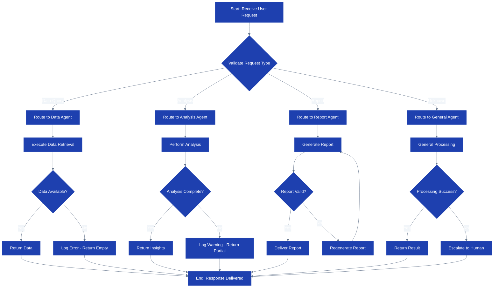
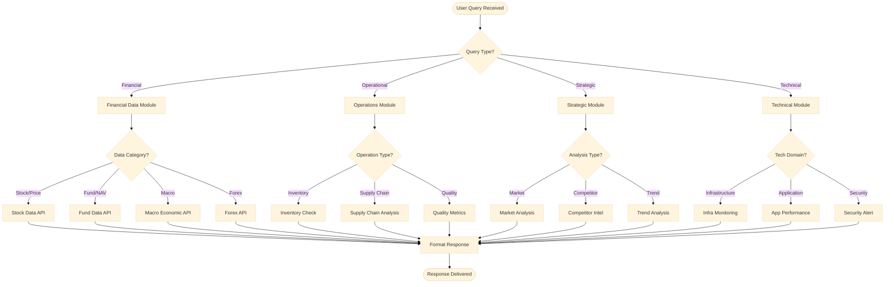
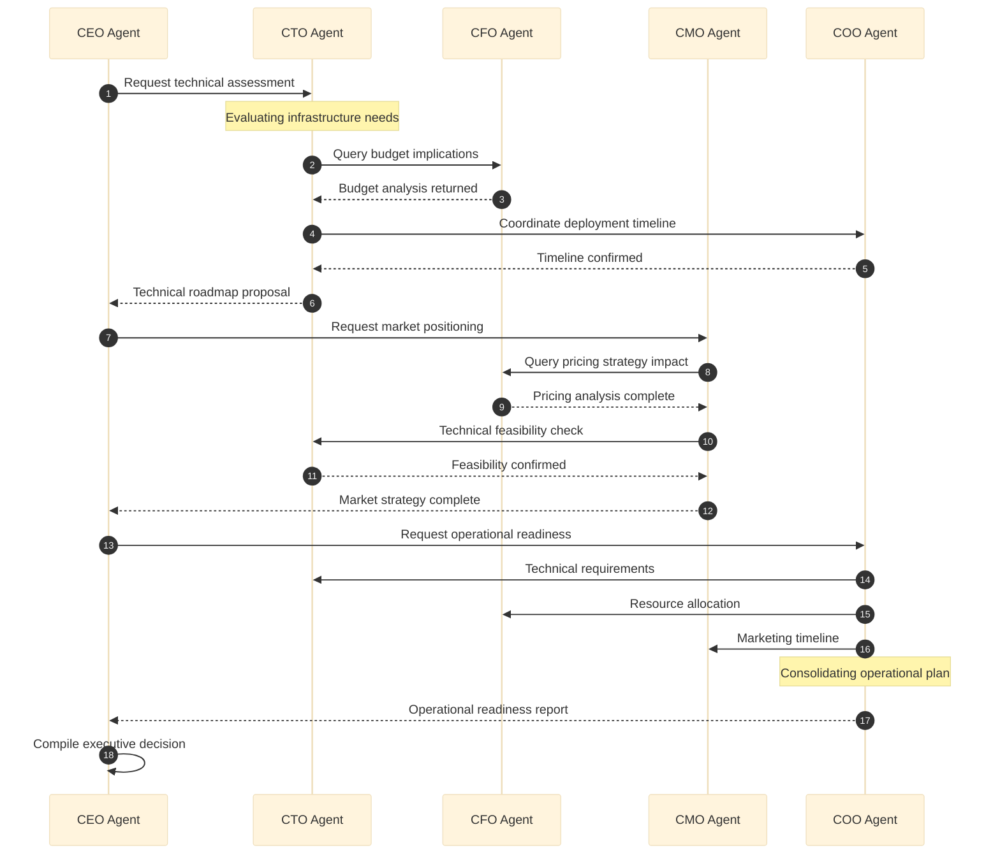
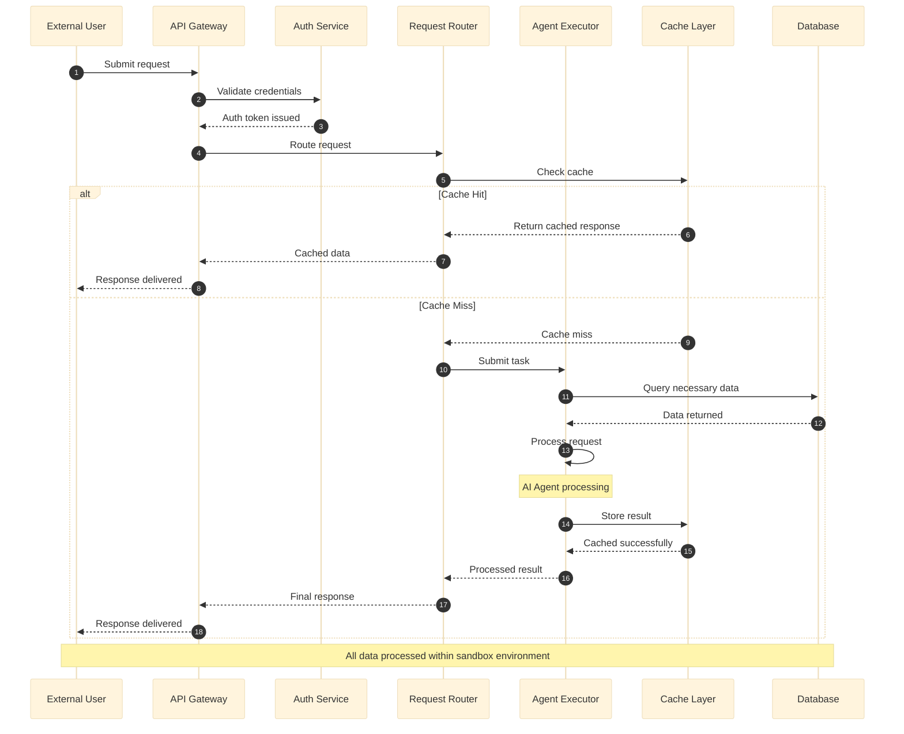
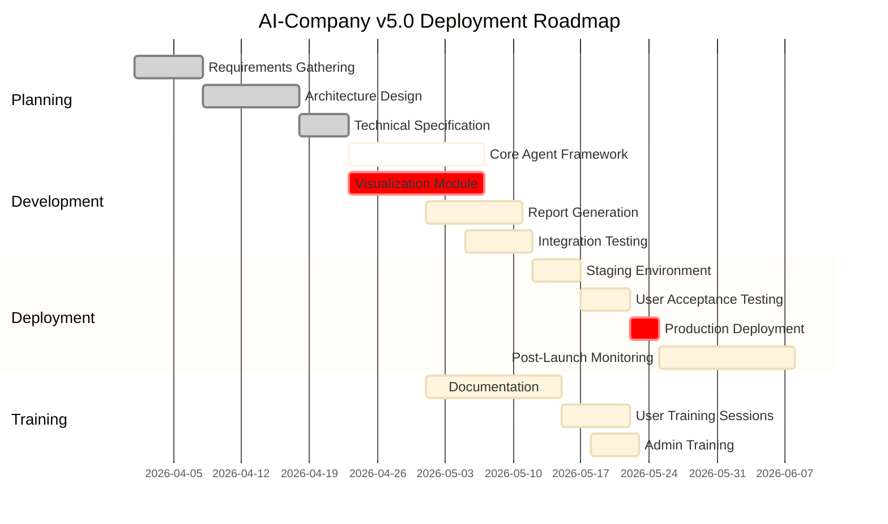
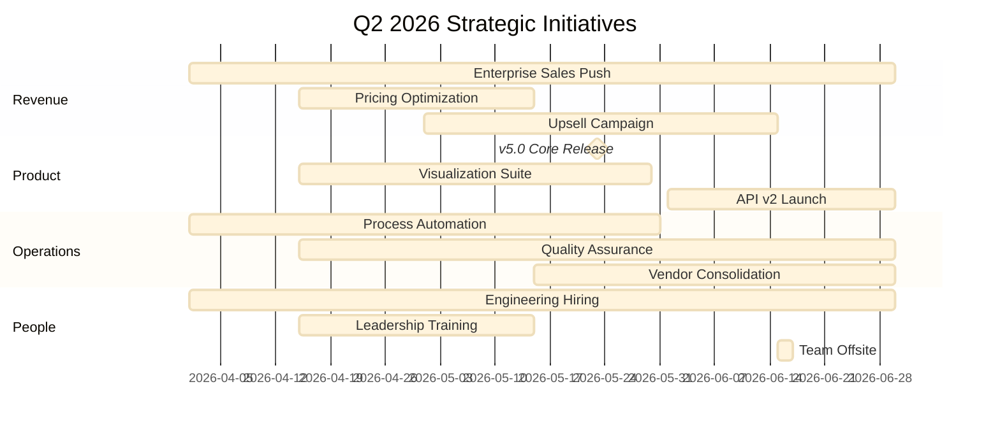
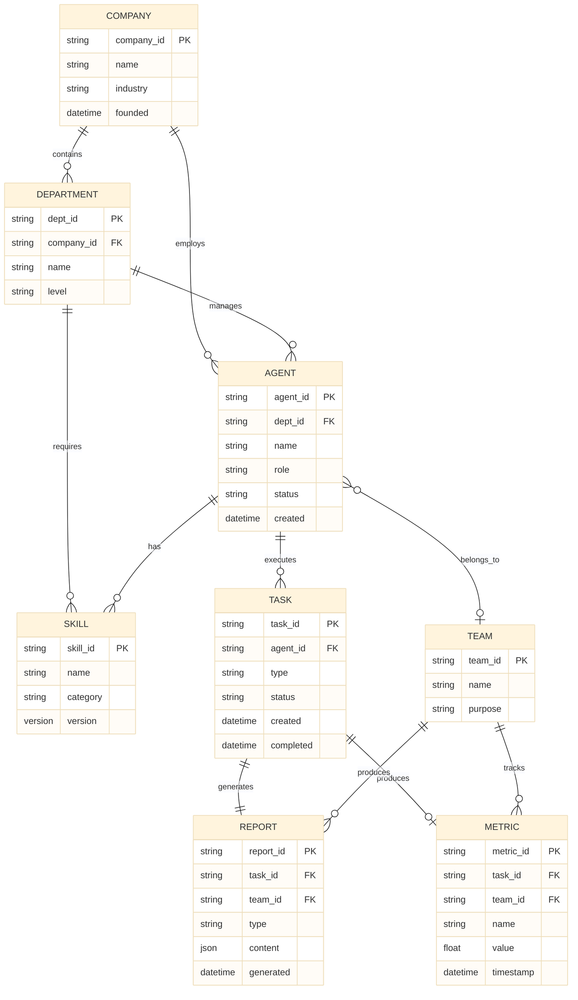
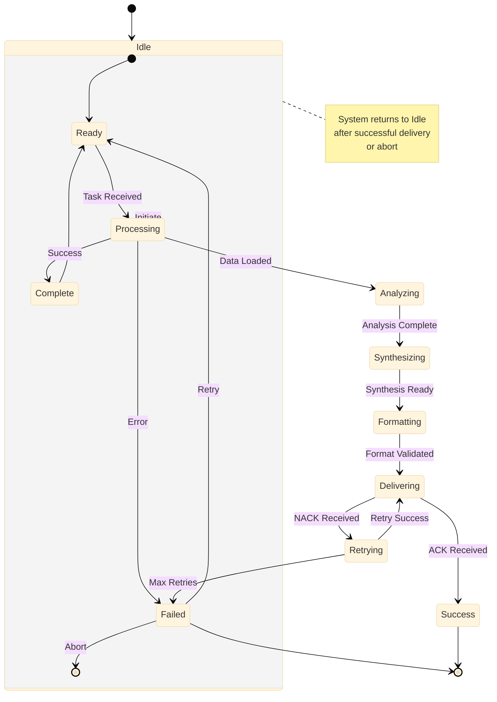

# Visualization Reference Guide

## AI-Company Visualization Module

**Version:** 1.0.0  
**Last Updated:** 2026-04-27  
**Compliance:** AIGC-Compliant | Enterprise-Safe | No External Data Exfiltration  

---

## Table of Contents

1. [Chart Types](#1-chart-types)
2. [Report Templates](#2-report-templates)
3. [Mermaid Diagrams](#3-mermaid-diagrams)
4. [Integration](#4-integration-with-ceo-command-center)
5. [Constraints and Compliance](#5-constraints-and-compliance)

---

## 1. Chart Types

This section provides comprehensive guidance for creating visualizations using Chart.js as the primary library. All templates are designed to be enterprise-safe, VirusTotal-compliant, and free from external data exfiltration risks.

### 1.1 Line Charts

#### When to Use Line Charts

Line charts are the most versatile visualization type and should be your default choice for the following scenarios:

- **Time-series data**: Displaying trends over continuous time periods (daily, weekly, monthly, quarterly, yearly)
- **Trend analysis**: Showing the direction and magnitude of changes over time
- **Comparison**: Comparing multiple data series on the same time axis
- **Forecasting**: Visualizing historical patterns that may indicate future trends
- **Rate of change**: Highlighting acceleration, deceleration, or constant growth/decline

Line charts are NOT appropriate when:
- You need to show part-to-whole relationships (use Pie or Doughnut)
- The x-axis represents categorical data without inherent ordering (use Bar charts)
- You want to emphasize individual values rather than trends
- The data has too many distinct series (maximum 5-7 for readability)

#### Key Parameters

```javascript
// Core parameters for Line Charts
{
  type: 'line',
  data: {
    labels: [],        // X-axis labels (typically dates or time periods)
    datasets: [{
      label: '',       // Series name for legend and tooltip
      data: [],        // Numeric values aligned with labels
      borderColor: '', // Line color (hex or rgba)
      backgroundColor: '', // Fill color below line
      fill: true/false, // Whether to fill area below line
      tension: 0.4,    // Line curvature (0 = straight, 1 = very curved)
      pointRadius: 3,  // Size of data points
      pointHoverRadius: 6, // Size on hover
      borderWidth: 2,  // Line thickness in pixels
    }]
  },
  options: {
    responsive: true,           // Automatically resize to container
    maintainAspectRatio: false, // Allow custom height/width ratio
    interaction: {
      mode: 'index',            // 'index' shows all values at x-axis point
      intersect: false,         // Trigger tooltip even when not directly on point
    },
    plugins: {
      legend: {
        display: true,
        position: 'top',        // 'top', 'bottom', 'left', 'right'
        labels: {
          color: '#333333',
          font: { size: 12 }
        }
      },
      tooltip: {
        enabled: true,
        callbacks: {
          label: function(context) {
            return context.dataset.label + ': ' + context.parsed.y;
          }
        }
      }
    },
    scales: {
      x: {
        title: { display: true, text: 'Time Period' },
        grid: { display: false }
      },
      y: {
        title: { display: true, text: 'Value' },
        beginAtZero: false      // Set true only if negative values are not meaningful
      }
    }
  }
}
```

#### Code Template: Basic Line Chart

```html
<!-- Line Chart Template - Enterprise Safe -->
<!-- AIGC Generated Content - Internal Use Only -->
<!DOCTYPE html>
<html lang="en">
<head>
  <meta charset="UTF-8">
  <meta name="viewport" content="width=device-width, initial-scale=1.0">
  <title>Line Chart - Trend Visualization</title>
  <!-- AIGC Generated Content -->
  <style>
    .chart-container {
      position: relative;
      height: 400px;
      width: 100%;
      max-width: 800px;
      margin: 0 auto;
      padding: 20px;
      background: #ffffff;
      border-radius: 8px;
      box-shadow: 0 2px 8px rgba(0,0,0,0.1);
    }
    .aigc-label {
      position: absolute;
      bottom: 5px;
      right: 10px;
      font-size: 10px;
      color: #666;
      opacity: 0.7;
    }
  </style>
</head>
<body>
  <div class="chart-container">
    <canvas id="lineChart"></canvas>
    <div class="aigc-label">AIGC Generated Content</div>
  </div>

  <!-- Chart.js loaded from local bundled file - NO external CDN -->
  <!-- Replace '/local/path/to/chart.umd.js' with actual local path -->
  <script src="/local/path/to/chart.umd.js"></script>
  <script>
    (function() {
      'use strict';
      
      // Data configuration - customize labels and values
      const chartData = {
        labels: ['Jan', 'Feb', 'Mar', 'Apr', 'May', 'Jun'],
        datasets: [{
          label: 'Revenue (in thousands)',
          data: [65, 59, 80, 81, 56, 55],
          borderColor: '#2563eb',
          backgroundColor: 'rgba(37, 99, 235, 0.1)',
          fill: true,
          tension: 0.4,
          pointRadius: 4,
          pointHoverRadius: 6
        }]
      };

      // Chart configuration
      const config = {
        type: 'line',
        data: chartData,
        options: {
          responsive: true,
          maintainAspectRatio: false,
          plugins: {
            legend: {
              display: true,
              position: 'top'
            },
            tooltip: {
              enabled: true,
              callbacks: {
                label: function(context) {
                  return context.dataset.label + ': ' + context.parsed.y.toLocaleString();
                }
              }
            }
          },
          scales: {
            y: {
              beginAtZero: false,
              title: {
                display: true,
                text: 'Revenue ($K)'
              }
            }
          }
        }
      };

      // Initialize chart
      const ctx = document.getElementById('lineChart').getContext('2d');
      new Chart(ctx, config);
    })();
  </script>
</body>
</html>
```

#### Code Template: Multi-Line Chart with Multiple Datasets

```html
<!-- Multi-Line Chart Template -->
<!-- AIGC Generated Content - Internal Use Only -->
<!DOCTYPE html>
<html lang="en">
<head>
  <meta charset="UTF-8">
  <title>Multi-Line Trend Analysis</title>
  <style>
    .chart-container { position: relative; height: 450px; width: 100%; }
    .aigc-disclaimer { font-size: 9px; color: #888; margin-top: 10px; }
  </style>
</head>
<body>
  <div class="chart-container">
    <canvas id="multiLineChart"></canvas>
  </div>
  <p class="aigc-disclaimer">AIGC Generated Content - Verify Before Use</p>

  <script src="/local/path/to/chart.umd.js"></script>
  <script>
    (function() {
      'use strict';
      
      const multiLineData = {
        labels: ['Q1 2025', 'Q2 2025', 'Q3 2025', 'Q4 2025', 'Q1 2026'],
        datasets: [
          {
            label: 'Product Revenue',
            data: [120, 145, 132, 168, 185],
            borderColor: '#2563eb',
            backgroundColor: 'rgba(37, 99, 235, 0.1)',
            borderWidth: 2,
            tension: 0.3,
            fill: false
          },
          {
            label: 'Service Revenue',
            data: [85, 92, 98, 105, 112],
            borderColor: '#059669',
            backgroundColor: 'rgba(5, 150, 105, 0.1)',
            borderWidth: 2,
            tension: 0.3,
            fill: false
          },
          {
            label: 'Licensing Revenue',
            data: [42, 48, 45, 52, 58],
            borderColor: '#7c3aed',
            backgroundColor: 'rgba(124, 58, 237, 0.1)',
            borderWidth: 2,
            tension: 0.3,
            fill: false
          }
        ]
      };

      const config = {
        type: 'line',
        data: multiLineData,
        options: {
          responsive: true,
          maintainAspectRatio: false,
          interaction: {
            mode: 'index',
            intersect: false
          },
          plugins: {
            legend: { position: 'top' },
            tooltip: {
              callbacks: {
                afterBody: function(tooltipItems) {
                  return '\nAIGC Generated - Verify Data Accuracy';
                }
              }
            }
          },
          scales: {
            y: {
              type: 'linear',
              display: true,
              position: 'left',
              title: { display: true, text: 'Revenue ($K)' }
            }
          }
        }
      };

      new Chart(document.getElementById('multiLineChart').getContext('2d'), config);
    })();
  </script>
</body>
</html>
```

#### Compliance Notes for Line Charts

- All data processing must occur client-side within the browser sandbox
- No external API calls for data enrichment are permitted without explicit approval
- Chart rendering must complete within 2 seconds for datasets up to 10,000 points
- AIGC labeling must be visible in both printed and digital outputs
- Color choices must maintain WCAG AA contrast ratios (minimum 4.5:1 for text)

---

### 1.2 Bar Charts

#### When to Use Bar Charts

Bar charts are optimal for the following use cases:

- **Categorical comparisons**: Comparing discrete categories side-by-side
- **Frequency distributions**: Showing how many items fall into each category
- **Ranking visualization**: Displaying items sorted by value
- **Survey results**: Presenting response distributions
- **Period comparisons**: Comparing values across non-continuous time periods
- **Single time point analysis**: When you want to emphasize individual values rather than trends

Bar charts should be avoided when:
- Showing trends over continuous time (use Line charts instead)
- Displaying part-to-whole relationships with many categories (use Pie if less than 6 categories)
- The categories have no natural ordering
- You need to show data with more than 2 dimensions

#### Key Parameters

```javascript
// Core parameters for Bar Charts
{
  type: 'bar',  // or 'bar' | 'horizontalBar' (use 'bar' with indexAxis: 'y' for horizontal)
  data: {
    labels: [],     // Category labels for each bar
    datasets: [{
      label: '',    // Series name
      data: [],     // Numeric values for each bar
      backgroundColor: [], // Array of colors or single color
      borderColor: [],     // Border color for each bar
      borderWidth: 1,      // Border thickness
      borderRadius: 4,    // Rounded bar corners (Chart.js 3.0+)
      barPercentage: 0.8, // Width of bars relative to grid
      categoryPercentage: 0.9 // Space between categories
    }]
  },
  options: {
    responsive: true,
    indexAxis: 'x',  // 'x' for vertical, 'y' for horizontal bars
    plugins: {
      legend: { display: true },
      tooltip: { enabled: true }
    },
    scales: {
      x: {
        grid: { display: false },
        ticks: { maxRotation: 45 }
      },
      y: {
        beginAtZero: true,
        grid: { color: '#e0e0e0' }
      }
    }
  }
}
```

#### Code Template: Vertical Bar Chart

```html
<!-- Vertical Bar Chart Template -->
<!-- AIGC Generated Content - Internal Use Only -->
<!DOCTYPE html>
<html lang="en">
<head>
  <meta charset="UTF-8">
  <title>Bar Chart - Category Comparison</title>
  <style>
    .chart-wrapper {
      max-width: 900px;
      margin: 0 auto;
      padding: 20px;
      background: #fafafa;
      border-radius: 8px;
    }
    .chart-container { position: relative; height: 400px; }
    .aigc-label { 
      text-align: right; 
      font-size: 10px; 
      color: #666; 
      margin-top: 8px; 
    }
  </style>
</head>
<body>
  <div class="chart-wrapper">
    <div class="chart-container">
      <canvas id="barChart"></canvas>
    </div>
    <div class="aigc-label">AIGC Generated Content - Review Before Distribution</div>
  </div>

  <script src="/local/path/to/chart.umd.js"></script>
  <script>
    (function() {
      'use strict';
      
      // Department performance data
      const barData = {
        labels: ['Engineering', 'Sales', 'Marketing', 'Operations', 'Finance', 'HR'],
        datasets: [{
          label: 'Quarterly Performance Score',
          data: [92, 78, 85, 71, 88, 76],
          backgroundColor: [
            'rgba(37, 99, 235, 0.8)',
            'rgba(16, 185, 129, 0.8)',
            'rgba(245, 158, 11, 0.8)',
            'rgba(239, 68, 68, 0.8)',
            'rgba(139, 92, 246, 0.8)',
            'rgba(236, 72, 153, 0.8)'
          ],
          borderColor: [
            '#2563eb',
            '#10b981',
            '#f59e0b',
            '#ef4444',
            '#8b5cf6',
            '#ec4899'
          ],
          borderWidth: 2,
          borderRadius: 6
        }]
      };

      const config = {
        type: 'bar',
        data: barData,
        options: {
          responsive: true,
          maintainAspectRatio: false,
          plugins: {
            legend: {
              display: true,
              position: 'top',
              labels: { font: { size: 12 } }
            },
            tooltip: {
              enabled: true,
              callbacks: {
                label: function(context) {
                  return 'Score: ' + context.parsed.y + '/100';
                },
                footer: function() {
                  return '\nGenerated by AI - Verify Accuracy';
                }
              }
            }
          },
          scales: {
            y: {
              beginAtZero: true,
              max: 100,
              title: {
                display: true,
                text: 'Performance Score',
                font: { size: 14 }
              },
              grid: { color: '#e5e7eb' }
            },
            x: {
              title: {
                display: true,
                text: 'Department',
                font: { size: 14 }
              },
              grid: { display: false }
            }
          }
        }
      };

      new Chart(document.getElementById('barChart').getContext('2d'), config);
    })();
  </script>
</body>
</html>
```

#### Code Template: Grouped Bar Chart for Comparison

```html
<!-- Grouped Bar Chart Template -->
<!-- AIGC Generated Content - Internal Use Only -->
<!DOCTYPE html>
<html lang="en">
<head>
  <meta charset="UTF-8">
  <title>Grouped Bar Chart - Multi-Year Comparison</title>
  <style>
    body { font-family: system-ui, sans-serif; padding: 20px; background: #f5f5f5; }
    .container { background: white; padding: 24px; border-radius: 12px; max-width: 1000px; margin: 0 auto; }
    .chart-container { position: relative; height: 400px; }
    .aigc-notice { font-size: 9px; color: #999; margin-top: 12px; text-align: right; }
  </style>
</head>
<body>
  <div class="container">
    <h2 style="text-align: center; margin-bottom: 20px;">Annual Revenue by Region</h2>
    <div class="chart-container">
      <canvas id="groupedBarChart"></canvas>
    </div>
    <div class="aigc-notice">AIGC Generated Content</div>
  </div>

  <script src="/local/path/to/chart.umd.js"></script>
  <script>
    (function() {
      'use strict';
      
      const groupedData = {
        labels: ['North America', 'Europe', 'Asia Pacific', 'Latin America'],
        datasets: [
          {
            label: 'FY 2025',
            data: [4500, 3200, 2800, 950],
            backgroundColor: 'rgba(37, 99, 235, 0.85)',
            borderColor: '#2563eb',
            borderWidth: 1
          },
          {
            label: 'FY 2026',
            data: [5200, 3600, 3400, 1100],
            backgroundColor: 'rgba(16, 185, 129, 0.85)',
            borderColor: '#10b981',
            borderWidth: 1
          }
        ]
      };

      const config = {
        type: 'bar',
        data: groupedData,
        options: {
          responsive: true,
          maintainAspectRatio: false,
          plugins: {
            legend: { position: 'top' },
            tooltip: {
              callbacks: {
                label: function(context) {
                  return context.dataset.label + ': $' + context.parsed.y.toLocaleString() + 'K';
                }
              }
            }
          },
          scales: {
            x: {
              grid: { display: false }
            },
            y: {
              beginAtZero: true,
              title: {
                display: true,
                text: 'Revenue ($K)'
              },
              ticks: {
                callback: function(value) {
                  return '$' + value.toLocaleString() + 'K';
                }
              }
            }
          }
        }
      };

      new Chart(document.getElementById('groupedBarChart').getContext('2d'), config);
    })();
  </script>
</body>
</html>
```

#### Code Template: Stacked Bar Chart

```html
<!-- Stacked Bar Chart Template -->
<!-- AIGC Generated Content - Internal Use Only -->
<!DOCTYPE html>
<html lang="en">
<head>
  <meta charset="UTF-8">
  <title>Stacked Bar Chart - Composition Analysis</title>
  <style>
    .container { max-width: 1000px; margin: 20px auto; padding: 20px; }
    .chart-container { position: relative; height: 400px; }
  </style>
</head>
<body>
  <div class="container">
    <h2 style="text-align: center;">Expense Breakdown by Quarter</h2>
    <div class="chart-container">
      <canvas id="stackedBarChart"></canvas>
    </div>
    <p style="font-size: 9px; color: #888; text-align: right; margin-top: 8px;">AIGC Generated</p>
  </div>

  <script src="/local/path/to/chart.umd.js"></script>
  <script>
    (function() {
      'use strict';
      
      const stackedData = {
        labels: ['Q1', 'Q2', 'Q3', 'Q4'],
        datasets: [
          {
            label: 'Personnel',
            data: [450, 470, 480, 500],
            backgroundColor: 'rgba(37, 99, 235, 0.9)'
          },
          {
            label: 'Infrastructure',
            data: [120, 115, 110, 105],
            backgroundColor: 'rgba(16, 185, 129, 0.9)'
          },
          {
            label: 'Marketing',
            data: [80, 95, 110, 130],
            backgroundColor: 'rgba(245, 158, 11, 0.9)'
          },
          {
            label: 'R&D',
            data: [200, 220, 250, 280],
            backgroundColor: 'rgba(139, 92, 246, 0.9)'
          }
        ]
      };

      const config = {
        type: 'bar',
        data: stackedData,
        options: {
          responsive: true,
          maintainAspectRatio: false,
          plugins: {
            legend: { position: 'top' },
            tooltip: {
              callbacks: {
                label: function(context) {
                  return context.dataset.label + ': $' + context.parsed.y.toLocaleString() + 'K';
                }
              }
            }
          },
          scales: {
            x: { stacked: true },
            y: {
              stacked: true,
              title: { display: true, text: 'Expenses ($K)' }
            }
          }
        }
      };

      new Chart(document.getElementById('stackedBarChart').getContext('2d'), config);
    })();
  </script>
</body>
</html>
```

#### Compliance Notes for Bar Charts

- Bar charts with more than 10 categories should include data tables as supplementary material
- Stacked bar charts should not exceed 6 segments per bar for readability
- Grouped bar charts are limited to maximum 4 groups for clear visual distinction
- Percentage calculations displayed in tooltips must be mathematically accurate
- AIGC labeling must be present in all generated outputs

---

### 1.3 Pie Charts

#### When to Use Pie Charts

Pie charts are appropriate for the following scenarios:

- **Part-to-whole relationships**: Showing how individual segments relate to the total
- **Limited categories**: Displaying 2-5 distinct segments (never more than 7)
- **High contrast emphasis**: When one segment significantly dominates others
- **Single point in time**: Showing a snapshot distribution at one moment
- **Simple proportions**: When approximate visual comparison is acceptable

Pie charts should be avoided when:
- Comparing multiple pie charts side by side (very difficult to interpret)
- You need precise comparison of similar-sized segments
- There are more than 5-7 categories
- You want to show trends over time
- The segments represent negative values
- You need to show data with high precision

#### Key Parameters

```javascript
// Core parameters for Pie Charts
{
  type: 'pie',
  data: {
    labels: [],      // Segment labels
    datasets: [{
      data: [],      // Values for each segment
      backgroundColor: [], // Colors for each segment
      borderColor: '#ffffff', // Border between segments
      borderWidth: 2,
      hoverOffset: 10, // How far segment moves on hover
    }]
  },
  options: {
    responsive: true,
    maintainAspectRatio: true, // Pie charts work best with aspect ratio
    plugins: {
      legend: {
        position: 'right', // 'top', 'bottom', 'left', 'right'
        labels: {
          padding: 15,
          usePointStyle: true,
          font: { size: 12 }
        }
      },
      tooltip: {
        callbacks: {
          label: function(context) {
            const value = context.parsed;
            const total = context.dataset.data.reduce((a, b) => a + b, 0);
            const percentage = ((value / total) * 100).toFixed(1);
            return context.label + ': ' + percentage + '%';
          }
        }
      }
    }
  }
}
```

#### Code Template: Basic Pie Chart

```html
<!-- Pie Chart Template -->
<!-- AIGC Generated Content - Internal Use Only -->
<!DOCTYPE html>
<html lang="en">
<head>
  <meta charset="UTF-8">
  <title>Pie Chart - Market Share Distribution</title>
  <style>
    body { font-family: system-ui, sans-serif; display: flex; justify-content: center; padding: 40px; background: #f8fafc; }
    .chart-wrapper { background: white; padding: 32px; border-radius: 16px; box-shadow: 0 4px 12px rgba(0,0,0,0.08); max-width: 700px; }
    .chart-container { position: relative; height: 400px; width: 100%; }
    .aigc-label { text-align: center; margin-top: 16px; font-size: 10px; color: #94a3b8; }
  </style>
</head>
<body>
  <div class="chart-wrapper">
    <h2 style="text-align: center; margin-bottom: 24px;">Market Share by Product Line</h2>
    <div class="chart-container">
      <canvas id="pieChart"></canvas>
    </div>
    <div class="aigc-label">AIGC Generated Content - Verify Data Accuracy</div>
  </div>

  <script src="/local/path/to/chart.umd.js"></script>
  <script>
    (function() {
      'use strict';
      
      const pieData = {
        labels: ['Enterprise Software', 'Cloud Services', 'Hardware', 'Support & Maintenance', 'Consulting'],
        datasets: [{
          data: [35, 28, 18, 12, 7],
          backgroundColor: [
            '#2563eb',  // Blue
            '#10b981',  // Green
            '#f59e0b',  // Amber
            '#ef4444',  // Red
            '#8b5cf6'   // Purple
          ],
          borderColor: '#ffffff',
          borderWidth: 3,
          hoverOffset: 15
        }]
      };

      const config = {
        type: 'pie',
        data: pieData,
        options: {
          responsive: true,
          maintainAspectRatio: true,
          plugins: {
            legend: {
              position: 'right',
              labels: {
                padding: 16,
                usePointStyle: true,
                font: { size: 12, weight: '500' }
              }
            },
            tooltip: {
              callbacks: {
                label: function(context) {
                  const total = context.dataset.data.reduce((a, b) => a + b, 0);
                  const percentage = ((context.parsed / total) * 100).toFixed(1);
                  return context.label + ': ' + percentage + '% (' + context.parsed + '%)';
                },
                footer: function() {
                  return '\nGenerated by AI System';
                }
              }
            }
          }
        }
      };

      new Chart(document.getElementById('pieChart').getContext('2d'), config);
    })();
  </script>
</body>
</html>
```

#### Code Template: Pie Chart with Center Text

```html
<!-- Pie Chart with Center Hole Template -->
<!-- AIGC Generated Content - Internal Use Only -->
<!DOCTYPE html>
<html lang="en">
<head>
  <meta charset="UTF-8">
  <title>Pie Chart - Budget Allocation</title>
  <style>
    body { display: flex; justify-content: center; padding: 40px; background: #1e293b; }
    .chart-wrapper { background: #334155; padding: 32px; border-radius: 16px; max-width: 600px; }
    h2 { color: #f1f5f9; text-align: center; margin-bottom: 24px; }
    .chart-container { position: relative; height: 400px; width: 100%; }
    .center-text { position: absolute; top: 50%; left: 50%; transform: translate(-50%, -50%); text-align: center; color: white; }
    .center-text .value { font-size: 32px; font-weight: bold; }
    .center-text .label { font-size: 14px; opacity: 0.8; }
    .aigc-label { color: #94a3b8; text-align: center; margin-top: 16px; font-size: 10px; }
  </style>
</head>
<body>
  <div class="chart-wrapper">
    <h2>Annual Budget Allocation</h2>
    <div class="chart-container">
      <canvas id="donutChart"></canvas>
      <div class="center-text">
        <div class="value">$10.5M</div>
        <div class="label">Total Budget</div>
      </div>
    </div>
    <div class="aigc-label">AIGC Generated Content</div>
  </div>

  <script src="/local/path/to/chart.umd.js"></script>
  <script>
    (function() {
      'use strict';
      
      const donutData = {
        labels: ['Operations', 'R&D', 'Marketing', 'Sales', 'Administration'],
        datasets: [{
          data: [30, 25, 20, 15, 10],
          backgroundColor: [
            '#3b82f6',
            '#22c55e',
            '#f59e0b',
            '#ef4444',
            '#a855f7'
          ],
          borderWidth: 0,
          hoverOffset: 12
        }]
      };

      const config = {
        type: 'doughnut',
        data: donutData,
        options: {
          responsive: true,
          maintainAspectRatio: true,
          cutout: '60%',  // Creates the doughnut hole
          plugins: {
            legend: {
              position: 'bottom',
              labels: { color: '#f1f5f9', padding: 12, font: { size: 11 } }
            },
            tooltip: {
              callbacks: {
                label: function(context) {
                  return context.label + ': ' + context.parsed + '%';
                }
              }
            }
          }
        }
      };

      new Chart(document.getElementById('donutChart').getContext('2d'), config);
    })();
  </script>
</body>
</html>
```

#### Compliance Notes for Pie Charts

- Pie charts must never be used to display negative values
- The sum of all segments should equal 100% (display any remainder as "Other" if needed)
- Pie charts must not be used for precise numerical comparisons
- Always include a legend when segment labels are not displayed directly on the chart
- Accessibility requirement: Charts must be interpretable without relying on color alone

---

### 1.4 Doughnut Charts

#### When to Use Doughnut Charts

Doughnut charts (a variant of pie charts with a center cutout) are appropriate for:

- **Single metric emphasis**: Displaying one key metric prominently in the center
- **Space efficiency**: When you need a pie-style chart but have limited horizontal space
- **Part-to-whole with 2-4 segments**: Cleaner visual than pie for fewer segments
- **Multi-chart comparison**: Easier to compare side-by-side than pie charts
- **Progress indicators**: Showing completion percentages or targets

#### Code Template: Multi-Player Doughnut Comparison

```html
<!-- Multi-Doughnut Chart Template -->
<!-- AIGC Generated Content - Internal Use Only -->
<!DOCTYPE html>
<html lang="en">
<head>
  <meta charset="UTF-8">
  <title>Doughnut Chart Comparison</title>
  <style>
    body { font-family: system-ui, sans-serif; padding: 40px; background: #f8fafc; }
    .comparison-container { display: flex; justify-content: center; gap: 40px; flex-wrap: wrap; max-width: 1200px; margin: 0 auto; }
    .chart-card { background: white; border-radius: 12px; padding: 24px; box-shadow: 0 2px 8px rgba(0,0,0,0.06); text-align: center; }
    .chart-card h3 { margin: 0 0 16px 0; font-size: 16px; color: #334155; }
    .chart-container { position: relative; height: 200px; width: 200px; margin: 0 auto; }
    .center-label { position: absolute; top: 50%; left: 50%; transform: translate(-50%, -50%); font-size: 24px; font-weight: bold; color: #1e40af; }
    .aigc-label { font-size: 9px; color: #94a3b8; margin-top: 12px; }
  </style>
</head>
<body>
  <h2 style="text-align: center; margin-bottom: 32px;">Regional Performance Metrics</h2>
  
  <div class="comparison-container">
    <!-- North America -->
    <div class="chart-card">
      <h3>North America</h3>
      <div class="chart-container">
        <canvas id="chartNA"></canvas>
        <div class="center-label">85%</div>
      </div>
      <div class="aigc-label">AIGC Generated</div>
    </div>
    
    <!-- Europe -->
    <div class="chart-card">
      <h3>Europe</h3>
      <div class="chart-container">
        <canvas id="chartEU"></canvas>
        <div class="center-label">72%</div>
      </div>
      <div class="aigc-label">AIGC Generated</div>
    </div>
    
    <!-- Asia Pacific -->
    <div class="chart-card">
      <h3>Asia Pacific</h3>
      <div class="chart-container">
        <canvas id="chartAP"></canvas>
        <div class="center-label">91%</div>
      </div>
      <div class="aigc-label">AIGC Generated</div>
    </div>
  </div>

  <script src="/local/path/to/chart.umd.js"></script>
  <script>
    (function() {
      'use strict';
      
      function createDoughnutChart(canvasId, percentage, color) {
        const config = {
          type: 'doughnut',
          data: {
            datasets: [{
              data: [percentage, 100 - percentage],
              backgroundColor: [color, '#e2e8f0'],
              borderWidth: 0
            }]
          },
          options: {
            responsive: true,
            maintainAspectRatio: true,
            cutout: '75%',
            plugins: { legend: { display: false }, tooltip: { enabled: false } }
          }
        };
        new Chart(document.getElementById(canvasId).getContext('2d'), config);
      }
      
      createDoughnutChart('chartNA', 85, '#2563eb');
      createDoughnutChart('chartEU', 72, '#10b981');
      createDoughnutChart('chartAP', 91, '#f59e0b');
    })();
  </script>
</body>
</html>
```

#### Compliance Notes for Doughnut Charts

- Center text (when used) must meet minimum font size of 18px for accessibility
- Doughnut thickness should be consistent across multiple charts for fair comparison
- Cutout percentage between 60-75% is recommended for optimal visual balance
- When displaying percentage in center, ensure it matches the actual data segment

---

### 1.5 Matrix and Heatmap Charts

#### When to Use Matrix/Heatmap Charts

Heatmaps are optimal for the following scenarios:

- **Correlation analysis**: Showing relationships between two categorical variables
- **Time-based patterns**: Day/hour, month/day, or similar time matrix patterns
- **Performance grids**: Comparing multiple entities across multiple metrics
- **Geographic heatmaps**: Showing intensity variations across regions
- **Risk matrices**: Visualizing risk levels across categories
- **Calendar heatmaps**: Activity intensity over time (like GitHub contribution graphs)

Heatmaps should be avoided when:
- Both axes have more than 20 categories (visual overload)
- You need precise numerical comparison
- The data is already well-represented by simpler charts
- Color perception issues may affect interpretation

#### Key Parameters

```javascript
// Core parameters for Heatmap using Chart.js matrix plugin
{
  type: 'matrix',
  data: {
    datasets: [{
      label: 'Heatmap Data',
      data: [],  // Array of { x, y, v } objects
      backgroundColor: function(context) {
        // Color based on value
        const value = context.raw?.v;
        if (value === undefined) return 'transparent';
        // Gradient from blue (low) to red (high)
        const alpha = (value - min) / (max - min);
        return `rgba(239, 68, 68, ${alpha})`;
      },
      borderColor: function(context) {
        return '#ffffff';
      },
      borderWidth: 1,
      width: function(ctx) { return (ctx.chart.chartArea.width / 12) - 2; },
      height: function(ctx) { return (ctx.chart.chartArea.height / 7) - 2; }
    }]
  },
  options: {
    responsive: true,
    plugins: {
      legend: { display: false },
      tooltip: {
        callbacks: {
          label: function(context) {
            return 'Value: ' + context.raw.v;
          }
        }
      }
    },
    scales: {
      x: {
        type: 'category',
        labels: [],
        grid: { display: false }
      },
      y: {
        type: 'category',
        labels: [],
        grid: { display: false }
      }
    }
  }
}
```

#### Code Template: Correlation Heatmap

```html
<!-- Correlation Heatmap Template -->
<!-- AIGC Generated Content - Internal Use Only -->
<!DOCTYPE html>
<html lang="en">
<head>
  <meta charset="UTF-8">
  <title>Heatmap - Correlation Matrix</title>
  <!-- Matrix plugin required: https://chartjs-chart-matrix.js.org/ -->
  <style>
    body { font-family: system-ui, sans-serif; padding: 40px; background: #f8fafc; }
    .container { max-width: 900px; margin: 0 auto; background: white; padding: 32px; border-radius: 12px; }
    .chart-container { position: relative; height: 500px; width: 100%; }
    .legend-container { display: flex; justify-content: center; align-items: center; margin-top: 20px; gap: 8px; }
    .legend-gradient { width: 200px; height: 12px; background: linear-gradient(to right, #3b82f6, #fbbf24, #ef4444); border-radius: 4px; }
    .legend-labels { display: flex; justify-content: space-between; width: 200px; font-size: 11px; color: #64748b; }
    .aigc-label { text-align: center; margin-top: 16px; font-size: 10px; color: #94a3b8; }
  </style>
</head>
<body>
  <div class="container">
    <h2 style="text-align: center;">Sales Metrics Correlation Matrix</h2>
    <div class="chart-container">
      <canvas id="heatmapChart"></canvas>
    </div>
    <div class="legend-container">
      <span style="font-size: 11px; color: #64748b;">Low Correlation</span>
      <div>
        <div class="legend-gradient"></div>
        <div class="legend-labels">
          <span>-1.0</span>
          <span>0.0</span>
          <span>+1.0</span>
        </div>
      </div>
      <span style="font-size: 11px; color: #64748b;">High Correlation</span>
    </div>
    <div class="aigc-label">AIGC Generated Content - Statistical Correlation Analysis</div>
  </div>

  <!-- Chart.js Core -->
  <script src="/local/path/to/chart.umd.js"></script>
  <!-- Matrix Plugin for Heatmap -->
  <script src="/local/path/to/chartjs-chart-matrix.js"></script>
  
  <script>
    (function() {
      'use strict';
      
      // Correlation matrix data (6x6 grid)
      const metrics = ['Revenue', 'Growth', 'Margin', 'Retention', 'NPS', 'Support'];
      const correlationData = [
        { x: 0, y: 0, v: 1.00 }, { x: 1, y: 0, v: 0.85 }, { x: 2, y: 0, v: 0.72 }, { x: 3, y: 0, v: 0.45 }, { x: 4, y: 0, v: 0.38 }, { x: 5, y: 0, v: -0.22 },
        { x: 0, y: 1, v: 0.85 }, { x: 1, y: 1, v: 1.00 }, { x: 2, y: 1, v: 0.68 }, { x: 3, y: 1, v: 0.52 }, { x: 4, y: 1, v: 0.41 }, { x: 5, y: 1, v: -0.18 },
        { x: 0, y: 2, v: 0.72 }, { x: 1, y: 2, v: 0.68 }, { x: 2, y: 2, v: 1.00 }, { x: 3, y: 2, v: 0.33 }, { x: 4, y: 2, v: 0.29 }, { x: 5, y: 2, v: -0.35 },
        { x: 0, y: 3, v: 0.45 }, { x: 1, y: 3, v: 0.52 }, { x: 2, y: 3, v: 0.33 }, { x: 3, y: 3, v: 1.00 }, { x: 4, y: 3, v: 0.61 }, { x: 5, y: 3, v: -0.15 },
        { x: 0, y: 4, v: 0.38 }, { x: 1, y: 4, v: 0.41 }, { x: 2, y: 4, v: 0.29 }, { x: 3, y: 4, v: 0.61 }, { x: 4, y: 4, v: 1.00 }, { x: 5, y: 4, v: -0.08 },
        { x: 0, y: 5, v: -0.22 }, { x: 1, y: 5, v: -0.18 }, { x: 2, y: 5, v: -0.35 }, { x: 3, y: 5, v: -0.15 }, { x: 4, y: 5, v: -0.08 }, { x: 5, y: 5, v: 1.00 }
      ];

      function getCorrelationColor(value) {
        // Blue for negative, yellow for neutral, red for positive
        if (value >= 0) {
          const intensity = Math.min(value, 1);
          return `rgba(${Math.round(59 + (251 - 59) * intensity)}, ${Math.round(130 + (191 - 130) * (1 - intensity))}, ${Math.round(246 - 246 * intensity)}, 0.9)`;
        } else {
          const intensity = Math.min(Math.abs(value), 1);
          return `rgba(${Math.round(59 + (239 - 59) * intensity)}, ${Math.round(130 - 92 * intensity)}, ${Math.round(246 - 11 * intensity)}, 0.9)`;
        }
      }

      const config = {
        type: 'matrix',
        data: {
          datasets: [{
            label: 'Correlation',
            data: correlationData,
            backgroundColor: function(context) {
              const value = context.raw?.v;
              if (value === undefined) return 'transparent';
              return getCorrelationColor(value);
            },
            borderColor: '#ffffff',
            borderWidth: 1,
            width: function(ctx) { return Math.floor(ctx.chart.chartArea.width / 6) - 2; },
            height: function(ctx) { return Math.floor(ctx.chart.chartArea.height / 6) - 2; }
          }]
        },
        options: {
          responsive: true,
          maintainAspectRatio: false,
          plugins: {
            legend: { display: false },
            tooltip: {
              callbacks: {
                title: function(items) {
                  const item = items[0];
                  return metrics[item.raw.x] + ' vs ' + metrics[item.raw.y];
                },
                label: function(context) {
                  return 'Correlation: ' + context.raw.v.toFixed(2);
                },
                footer: function() { return '\nAIGC Generated - Verify Statistical Significance'; }
              }
            }
          },
          scales: {
            x: {
              type: 'category',
              labels: metrics,
              ticks: { font: { size: 11 } },
              grid: { display: false },
              position: 'top'
            },
            y: {
              type: 'category',
              labels: metrics,
              ticks: { font: { size: 11 } },
              grid: { display: false }
            }
          }
        }
      };

      new Chart(document.getElementById('heatmapChart').getContext('2d'), config);
    })();
  </script>
</body>
</html>
```

#### Code Template: Calendar Heatmap

```html
<!-- Calendar Heatmap Template -->
<!-- AIGC Generated Content - Internal Use Only -->
<!DOCTYPE html>
<html lang="en">
<head>
  <meta charset="UTF-8">
  <title>Calendar Heatmap - Activity Tracking</title>
  <style>
    body { font-family: system-ui, sans-serif; padding: 40px; background: #0f172a; }
    .container { max-width: 1100px; margin: 0 auto; background: #1e293b; padding: 32px; border-radius: 16px; }
    h2 { color: #f1f5f9; text-align: center; margin-bottom: 24px; }
    .chart-container { position: relative; height: 160px; }
    .month-labels { display: flex; justify-content: space-between; padding: 0 20px; color: #94a3b8; font-size: 11px; margin-bottom: 8px; }
    .day-labels { display: flex; flex-direction: column; justify-content: space-between; position: absolute; left: 0; top: 0; height: 140px; color: #64748b; font-size: 10px; padding: 2px 0; }
    .legend { display: flex; justify-content: flex-end; align-items: center; gap: 8px; margin-top: 16px; color: #94a3b8; font-size: 11px; }
    .legend-squares { display: flex; gap: 3px; }
    .legend-square { width: 12px; height: 12px; border-radius: 2px; }
    .aigc-label { color: #64748b; text-align: right; margin-top: 12px; font-size: 9px; }
  </style>
</head>
<body>
  <div class="container">
    <h2>Daily Activity Heatmap - 2026</h2>
    <div style="display: flex;">
      <div class="day-labels"><span>Mon</span><span>Wed</span><span>Fri</span></div>
      <div style="flex: 1; margin-left: 20px;">
        <div class="month-labels">
          <span>Jan</span><span>Feb</span><span>Mar</span><span>Apr</span><span>May</span><span>Jun</span>
          <span>Jul</span><span>Aug</span><span>Sep</span><span>Oct</span><span>Nov</span><span>Dec</span>
        </div>
        <div class="chart-container">
          <canvas id="calendarHeatmap"></canvas>
        </div>
      </div>
    </div>
    <div class="legend">
      <span>Less</span>
      <div class="legend-squares">
        <div class="legend-square" style="background: #1e3a5f;"></div>
        <div class="legend-square" style="background: #2563eb;"></div>
        <div class="legend-square" style="background: #3b82f6;"></div>
        <div class="legend-square" style="background: #60a5fa;"></div>
        <div class="legend-square" style="background: #93c5fd;"></div>
      </div>
      <span>More</span>
    </div>
    <div class="aigc-label">AIGC Generated Content</div>
  </div>

  <script src="/local/path/to/chart.umd.js"></script>
  <script src="/local/path/to/chartjs-chart-matrix.js"></script>
  <script>
    (function() {
      'use strict';
      
      // Generate sample data for 52 weeks
      const generateData = function() {
        const data = [];
        for (let week = 0; week < 52; week++) {
          for (let day = 0; day < 7; day++) {
            // Generate realistic activity pattern
            const isWeekend = day >= 5;
            const baseActivity = isWeekend ? 2 : 5;
            const variance = Math.random() * 3;
            const activity = Math.min(10, Math.max(0, Math.round(baseActivity + variance)));
            data.push({ x: week, y: day, v: activity });
          }
        }
        return data;
      };

      const heatmapData = generateData();

      function getHeatmapColor(value) {
        const levels = ['#1e3a5f', '#2563eb', '#3b82f6', '#60a5fa', '#93c5fd'];
        const index = Math.min(Math.floor(value / 2.5), 4);
        return levels[index];
      }

      const config = {
        type: 'matrix',
        data: {
          datasets: [{
            data: heatmapData,
            backgroundColor: function(context) {
              return getHeatmapColor(context.raw?.v || 0);
            },
            borderWidth: 0,
            width: function(ctx) { return Math.floor(ctx.chart.chartArea.width / 52) - 1; },
            height: function(ctx) { return Math.floor(ctx.chart.chartArea.height / 7) - 1; }
          }]
        },
        options: {
          responsive: true,
          maintainAspectRatio: false,
          plugins: { legend: { display: false }, tooltip: { enabled: true } },
          scales: {
            x: { display: false, type: 'linear', min: 0, max: 51 },
            y: { display: false, type: 'linear', min: 0, max: 6 }
          }
        }
      };

      new Chart(document.getElementById('calendarHeatmap').getContext('2d'), config);
    })();
  </script>
</body>
</html>
```

#### Compliance Notes for Matrix/Heatmap Charts

- Color scales must include a legend for accurate interpretation
- Consider colorblind-friendly palettes (avoid red-green gradients; use blue-orange instead)
- Matrix size should not exceed 20x20 cells for optimal readability
- Tooltips must display exact numerical values for accessibility
- AIGC labeling required on all generated heatmap outputs

---

## 2. Report Templates

This section provides four comprehensive report templates designed for enterprise use within the AI-Company system. Each template is self-contained, enterprise-safe, and includes AIGC compliance requirements.

### 2.1 Daily Brief Template

The Daily Brief is designed for quick executive consumption with key metrics, alerts, and a concise summary. This template is optimized for busy executives who need to quickly assess the current state of operations.

#### Template Structure

```html
<!-- Daily Brief Template -->
<!-- AIGC Generated Content - Internal Use Only -->
<!DOCTYPE html>
<html lang="en">
<head>
  <meta charset="UTF-8">
  <meta name="viewport" content="width=device-width, initial-scale=1.0">
  <title>Daily Brief - [Date]</title>
  <style>
    :root {
      --primary: #1e40af;
      --success: #059669;
      --warning: #d97706;
      --danger: #dc2626;
      --bg-light: #f8fafc;
      --text-dark: #1e293b;
      --text-muted: #64748b;
    }
    body { font-family: system-ui, -apple-system, sans-serif; margin: 0; padding: 20px; background: var(--bg-light); color: var(--text-dark); }
    .container { max-width: 900px; margin: 0 auto; }
    .header { display: flex; justify-content: space-between; align-items: center; margin-bottom: 24px; padding-bottom: 16px; border-bottom: 2px solid var(--primary); }
    .header h1 { margin: 0; color: var(--primary); font-size: 24px; }
    .header .date { color: var(--text-muted); font-size: 14px; }
    .grid { display: grid; grid-template-columns: repeat(auto-fit, minmax(200px, 1fr)); gap: 16px; margin-bottom: 24px; }
    .metric-card { background: white; padding: 20px; border-radius: 8px; box-shadow: 0 1px 3px rgba(0,0,0,0.1); border-left: 4px solid var(--primary); }
    .metric-card.success { border-left-color: var(--success); }
    .metric-card.warning { border-left-color: var(--warning); }
    .metric-card.danger { border-left-color: var(--danger); }
    .metric-card .label { font-size: 12px; color: var(--text-muted); text-transform: uppercase; letter-spacing: 0.5px; }
    .metric-card .value { font-size: 28px; font-weight: bold; margin: 8px 0; }
    .metric-card .change { font-size: 12px; }
    .metric-card .change.positive { color: var(--success); }
    .metric-card .change.negative { color: var(--danger); }
    .section { background: white; padding: 24px; border-radius: 8px; box-shadow: 0 1px 3px rgba(0,0,0,0.1); margin-bottom: 24px; }
    .section h2 { margin: 0 0 16px 0; font-size: 16px; color: var(--text-dark); border-bottom: 1px solid #e2e8f0; padding-bottom: 8px; }
    .alert { padding: 12px 16px; border-radius: 6px; margin-bottom: 8px; display: flex; align-items: center; gap: 12px; }
    .alert.warning { background: #fef3c7; border-left: 4px solid var(--warning); }
    .alert.danger { background: #fee2e2; border-left: 4px solid var(--danger); }
    .alert-icon { width: 20px; height: 20px; }
    .summary-text { line-height: 1.6; color: var(--text-dark); }
    .footer { text-align: center; padding: 16px; color: var(--text-muted); font-size: 11px; border-top: 1px solid #e2e8f0; margin-top: 24px; }
  </style>
</head>
<body>
  <div class="container">
    <!-- Header -->
    <div class="header">
      <h1>Daily Brief</h1>
      <div class="date">
        <span id="currentDate"></span> | Generated by AI System
      </div>
    </div>

    <!-- Key Metrics Grid -->
    <div class="grid">
      <div class="metric-card success">
        <div class="label">Revenue Today</div>
        <div class="value">$142,500</div>
        <div class="change positive">+12.3% vs yesterday</div>
      </div>
      <div class="metric-card">
        <div class="label">Active Users</div>
        <div class="value">8,432</div>
        <div class="change positive">+5.7% vs yesterday</div>
      </div>
      <div class="metric-card warning">
        <div class="label">Support Tickets</div>
        <div class="value">23</div>
        <div class="change negative">+8 tickets</div>
      </div>
      <div class="metric-card success">
        <div class="label">System Uptime</div>
        <div class="value">99.97%</div>
        <div class="change positive">SLA met</div>
      </div>
    </div>

    <!-- Alerts Section -->
    <div class="section">
      <h2>Alerts & Notifications</h2>
      <div class="alert warning">
        <svg class="alert-icon" viewBox="0 0 20 20" fill="currentColor"><path fill-rule="evenodd" d="M8.257 3.099c.765-1.36 2.722-1.36 3.486 0l5.58 9.92c.75 1.334-.213 2.98-1.742 2.98H4.42c-1.53 0-2.493-1.646-1.743-2.98l5.58-9.92zM11 13a1 1 0 11-2 0 1 1 0 012 0zm-1-8a1 1 0 00-1 1v3a1 1 0 002 0V6a1 1 0 00-1-1z" clip-rule="evenodd"/></svg>
        <span>Database migration scheduled for tonight 02:00-04:00 UTC. Expected downtime: 15 minutes.</span>
      </div>
      <div class="alert danger">
        <svg class="alert-icon" viewBox="0 0 20 20" fill="currentColor"><path fill-rule="evenodd" d="M10 18a8 8 0 100-16 8 8 0 000 16zM8.707 7.293a1 1 0 00-1.414 1.414L8.586 10l-1.293 1.293a1 1 0 101.414 1.414L10 11.414l1.293 1.293a1 1 0 001.414-1.414L11.414 10l1.293-1.293a1 1 0 00-1.414-1.414L10 8.586 8.707 7.293z" clip-rule="evenodd"/></svg>
        <span>Payment gateway latency spike detected (>800ms). Engineering investigating.</span>
      </div>
    </div>

    <!-- Executive Summary -->
    <div class="section">
      <h2>Executive Summary</h2>
      <p class="summary-text">
        Revenue performance exceeded projections by 12.3% driven primarily by strong enterprise sales in the North American region. 
        User engagement metrics remain healthy with 8,432 daily active users, up 5.7% from yesterday. 
        Support ticket volume has increased due to the recent feature release; the support team is adequately staffed to handle the additional load.
        System infrastructure remains stable with 99.97% uptime, maintaining SLA compliance.
      </p>
    </div>

    <!-- Footer -->
    <div class="footer">
      AIGC Generated Content | Daily Brief Report | Confidential - Internal Use Only
    </div>
  </div>

  <script>
    document.getElementById('currentDate').textContent = new Date().toLocaleDateString('en-US', { weekday: 'long', year: 'numeric', month: 'long', day: 'numeric' });
  </script>
</body>
</html>
```

#### Daily Brief Guidelines

- **Optimal length**: 300-500 words for executive summary
- **Update frequency**: Run daily at 07:00 local time for morning briefings
- **Metric cards**: Display 4-6 KPIs with trend indicators
- **Alerts**: Limit to maximum 5 urgent items; defer non-critical items to detailed reports
- **AIGC labeling**: Must be visible in both digital and printed formats

---

### 2.2 Weekly Summary Template

The Weekly Summary provides a comprehensive overview of the past week's performance, trends, and forward-looking plans. This template supports data-driven decision making with trend analysis and week-over-week comparisons.

#### Template Structure

```html
<!-- Weekly Summary Template -->
<!-- AIGC Generated Content - Internal Use Only -->
<!DOCTYPE html>
<html lang="en">
<head>
  <meta charset="UTF-8">
  <meta name="viewport" content="width=device-width, initial-scale=1.0">
  <title>Weekly Summary Report</title>
  <style>
    :root { --primary: #1e40af; --success: #059669; --warning: #d97706; --danger: #dc2626; --bg: #f8fafc; }
    * { box-sizing: border-box; }
    body { font-family: system-ui, -apple-system, sans-serif; margin: 0; padding: 20px; background: var(--bg); color: #1e293b; line-height: 1.5; }
    .container { max-width: 1000px; margin: 0 auto; }
    .header { background: var(--primary); color: white; padding: 24px 32px; border-radius: 12px 12px 0 0; }
    .header h1 { margin: 0 0 8px 0; font-size: 28px; }
    .header .subtitle { opacity: 0.9; font-size: 14px; }
    .content { background: white; padding: 32px; border-radius: 0 0 12px 12px; box-shadow: 0 4px 12px rgba(0,0,0,0.08); }
    h2 { color: var(--primary); font-size: 18px; margin: 0 0 16px 0; padding-bottom: 8px; border-bottom: 2px solid #e2e8f0; }
    .week-grid { display: grid; grid-template-columns: repeat(7, 1fr); gap: 8px; margin-bottom: 24px; }
    .day-card { background: #f8fafc; padding: 12px; border-radius: 8px; text-align: center; border: 1px solid #e2e8f0; }
    .day-card.today { border-color: var(--primary); background: #eff6ff; }
    .day-card .day-name { font-size: 11px; color: #64748b; text-transform: uppercase; }
    .day-card .day-value { font-size: 20px; font-weight: bold; color: #1e293b; }
    .day-card .day-change { font-size: 10px; }
    .day-card .day-change.up { color: var(--success); }
    .day-card .day-change.down { color: var(--danger); }
    .metrics-row { display: grid; grid-template-columns: repeat(auto-fit, minmax(220px, 1fr)); gap: 16px; margin-bottom: 24px; }
    .metric-box { background: linear-gradient(135deg, #f8fafc 0%, #f1f5f9 100%); padding: 20px; border-radius: 10px; border-left: 4px solid var(--primary); }
    .metric-box.success { border-left-color: var(--success); }
    .metric-box .metric-title { font-size: 12px; color: #64748b; text-transform: uppercase; letter-spacing: 0.5px; margin-bottom: 8px; }
    .metric-box .metric-value { font-size: 32px; font-weight: bold; color: #0f172a; }
    .metric-box .metric-sub { font-size: 13px; color: #64748b; margin-top: 4px; }
    .trend-chart { height: 250px; margin: 24px 0; padding: 16px; background: #f8fafc; border-radius: 10px; }
    .kpi-table { width: 100%; border-collapse: collapse; margin: 24px 0; }
    .kpi-table th { background: #f1f5f9; padding: 12px; text-align: left; font-size: 12px; text-transform: uppercase; color: #64748b; }
    .kpi-table td { padding: 12px; border-bottom: 1px solid #e2e8f0; }
    .kpi-table .status { padding: 4px 8px; border-radius: 4px; font-size: 11px; font-weight: 500; }
    .kpi-table .status.on-track { background: #d1fae5; color: #059669; }
    .kpi-table .status.at-risk { background: #fef3c7; color: #d97706; }
    .kpi-table .status.behind { background: #fee2e2; color: #dc2626; }
    .next-week { background: #eff6ff; padding: 20px; border-radius: 10px; border: 1px solid #bfdbfe; }
    .next-week h3 { margin: 0 0 12px 0; color: var(--primary); }
    .next-week ul { margin: 0; padding-left: 20px; }
    .next-week li { margin-bottom: 8px; color: #1e293b; }
    .footer { text-align: center; padding: 20px; color: #64748b; font-size: 11px; margin-top: 24px; }
  </style>
</head>
<body>
  <div class="container">
    <div class="header">
      <h1>Weekly Summary Report</h1>
      <div class="subtitle">Week of April 21 - April 27, 2026</div>
    </div>
    
    <div class="content">
      <!-- Weekly Trend Grid -->
      <section>
        <h2>Daily Performance Trend</h2>
        <div class="week-grid">
          <div class="day-card">
            <div class="day-name">Mon</div>
            <div class="day-value">$98K</div>
            <div class="day-change up">+8%</div>
          </div>
          <div class="day-card">
            <div class="day-name">Tue</div>
            <div class="day-value">$112K</div>
            <div class="day-change up">+14%</div>
          </div>
          <div class="day-card">
            <div class="day-name">Wed</div>
            <div class="day-value">$105K</div>
            <div class="day-change up">+6%</div>
          </div>
          <div class="day-card">
            <div class="day-name">Thu</div>
            <div class="day-value">$125K</div>
            <div class="day-change up">+18%</div>
          </div>
          <div class="day-card">
            <div class="day-name">Fri</div>
            <div class="day-value">$142K</div>
            <div class="day-change up">+22%</div>
          </div>
          <div class="day-card">
            <div class="day-name">Sat</div>
            <div class="day-value">$68K</div>
            <div class="day-change down">-3%</div>
          </div>
          <div class="day-card today">
            <div class="day-name">Sun</div>
            <div class="day-value">$52K</div>
            <div class="day-change up">+2%</div>
          </div>
        </div>
      </section>

      <!-- Key Metrics -->
      <section>
        <h2>Weekly KPIs</h2>
        <div class="metrics-row">
          <div class="metric-box success">
            <div class="metric-title">Total Revenue</div>
            <div class="metric-value">$702K</div>
            <div class="metric-sub">+14.2% vs last week</div>
          </div>
          <div class="metric-box">
            <div class="metric-title">New Customers</div>
            <div class="metric-value">127</div>
            <div class="metric-sub">+8 vs last week</div>
          </div>
          <div class="metric-box">
            <div class="metric-title">Avg Order Value</div>
            <div class="metric-value">$5,527</div>
            <div class="metric-sub">+3.5% vs last week</div>
          </div>
          <div class="metric-box">
            <div class="metric-title">Customer Retention</div>
            <div class="metric-value">94.2%</div>
            <div class="metric-sub">+1.1% vs last week</div>
          </div>
        </div>
      </section>

      <!-- Trend Visualization -->
      <section>
        <h2>Revenue Trend Chart</h2>
        <div class="trend-chart">
          <canvas id="weeklyTrendChart"></canvas>
        </div>
      </section>

      <!-- KPI Status Table -->
      <section>
        <h2>Initiative Status</h2>
        <table class="kpi-table">
          <thead>
            <tr>
              <th>Initiative</th>
              <th>Owner</th>
              <th>Progress</th>
              <th>Status</th>
              <th>Notes</th>
            </tr>
          </thead>
          <tbody>
            <tr>
              <td>Q2 Product Launch</td>
              <td>Product Team</td>
              <td>65%</td>
              <td><span class="status on-track">On Track</span></td>
              <td>Beta testing started</td>
            </tr>
            <tr>
              <td>Market Expansion</td>
              <td>Sales Team</td>
              <td>42%</td>
              <td><span class="status at-risk">At Risk</span></td>
              <td>Delay in regulatory approval</td>
            </tr>
            <tr>
              <td>Cost Optimization</td>
              <td>Operations</td>
              <td>78%</td>
              <td><span class="status on-track">On Track</span></td>
              <td>On schedule for June completion</td>
            </tr>
            <tr>
              <td>Platform Migration</td>
              <td>Engineering</td>
              <td>35%</td>
              <td><span class="status behind">Behind</span></td>
              <td>Resource constraints identified</td>
            </tr>
          </tbody>
        </table>
      </section>

      <!-- Next Week Plan -->
      <section>
        <h2>Next Week Plan</h2>
        <div class="next-week">
          <h3>Priority Items for April 28 - May 4, 2026</h3>
          <ul>
            <li><strong>Product Launch Preparation:</strong> Finalize beta feedback collection and prepare launch materials</li>
            <li><strong>Market Expansion:</strong> Follow up on regulatory queries and accelerate partner onboarding</li>
            <li><strong>Engineering Resources:</strong> Reallocate team members to address platform migration delays</li>
            <li><strong>Customer Success:</strong> Launch quarterly business reviews with top 20 accounts</li>
            <li><strong>Financial Review:</strong> Prepare Q1 financial statements for board presentation</li>
          </ul>
        </div>
      </section>
    </div>

    <div class="footer">
      AIGC Generated Content | Weekly Summary Report | Confidential - Internal Use Only<br>
      Generated: April 27, 2026 | Report Period: April 21-27, 2026
    </div>
  </div>

  <script src="/local/path/to/chart.umd.js"></script>
  <script>
    (function() {
      const ctx = document.getElementById('weeklyTrendChart').getContext('2d');
      new Chart(ctx, {
        type: 'line',
        data: {
          labels: ['Mon', 'Tue', 'Wed', 'Thu', 'Fri', 'Sat', 'Sun'],
          datasets: [{
            label: 'Revenue ($K)',
            data: [98, 112, 105, 125, 142, 68, 52],
            borderColor: '#1e40af',
            backgroundColor: 'rgba(30, 64, 175, 0.1)',
            fill: true,
            tension: 0.4
          }, {
            label: 'Target ($K)',
            data: [90, 100, 95, 110, 120, 70, 50],
            borderColor: '#94a3b8',
            borderDash: [5, 5],
            fill: false,
            tension: 0
          }]
        },
        options: {
          responsive: true,
          maintainAspectRatio: false,
          plugins: { legend: { position: 'top' } },
          scales: {
            y: { beginAtZero: false, title: { display: true, text: 'Revenue ($K)' } }
          }
        }
      });
    })();
  </script>
</body>
</html>
```

#### Weekly Summary Guidelines

- **Optimal length**: 800-1200 words for comprehensive coverage
- **Update frequency**: Generate every Monday at 08:00 for weekly planning meetings
- **Charts**: Include both actual vs target comparisons and trend lines
- **Initiative tracking**: Maximum 10 initiatives per report; prioritize by strategic importance
- **AIGC labeling**: Required in header and footer sections

---

### 2.3 KPI Dashboard Template

The KPI Dashboard provides a real-time scorecard view of organizational metrics with gauges, comparisons, and trend indicators. This template is optimized for monitoring dashboards and executive war rooms.

#### Template Structure

```html
<!-- KPI Dashboard Template -->
<!-- AIGC Generated Content - Internal Use Only -->
<!DOCTYPE html>
<html lang="en">
<head>
  <meta charset="UTF-8">
  <meta name="viewport" content="width=device-width, initial-scale=1.0">
  <title>KPI Dashboard - Executive Scorecard</title>
  <style>
    :root { --primary: #1e40af; --success: #059669; --warning: #d97706; --danger: #dc2626; --bg: #f1f5f9; }
    * { box-sizing: border-box; }
    body { font-family: system-ui, -apple-system, sans-serif; margin: 0; padding: 20px; background: var(--bg); min-height: 100vh; }
    .dashboard { max-width: 1400px; margin: 0 auto; }
    .header { display: flex; justify-content: space-between; align-items: center; padding: 20px 24px; background: white; border-radius: 12px; margin-bottom: 24px; box-shadow: 0 1px 3px rgba(0,0,0,0.1); }
    .header h1 { margin: 0; color: var(--primary); font-size: 24px; }
    .header-info { text-align: right; color: #64748b; font-size: 13px; }
    .gauge-grid { display: grid; grid-template-columns: repeat(auto-fit, minmax(280px, 1fr)); gap: 24px; margin-bottom: 32px; }
    .gauge-card { background: white; padding: 24px; border-radius: 12px; box-shadow: 0 2px 8px rgba(0,0,0,0.06); text-align: center; }
    .gauge-card h3 { margin: 0 0 16px 0; font-size: 14px; color: #64748b; text-transform: uppercase; letter-spacing: 0.5px; }
    .gauge-container { position: relative; width: 180px; height: 100px; margin: 0 auto 16px; }
    .gauge-background { fill: none; stroke: #e2e8f0; stroke-width: 20; }
    .gauge-fill { fill: none; stroke-width: 20; stroke-linecap: round; transition: stroke-dashoffset 1s ease-in-out; }
    .gauge-text { text-anchor: middle; font-size: 28px; font-weight: bold; fill: #1e293b; }
    .gauge-subtext { text-anchor: middle; font-size: 12px; fill: #64748b; }
    .gauge-value { font-size: 32px; font-weight: bold; color: #1e293b; }
    .gauge-label { font-size: 13px; color: #64748b; margin-top: 8px; }
    .comparison-section { display: grid; grid-template-columns: 1fr 1fr; gap: 24px; margin-bottom: 32px; }
    .comparison-card { background: white; padding: 24px; border-radius: 12px; box-shadow: 0 2px 8px rgba(0,0,0,0.06); }
    .comparison-card h3 { margin: 0 0 20px 0; font-size: 16px; color: #1e293b; border-bottom: 2px solid #e2e8f0; padding-bottom: 12px; }
    .comparison-chart { height: 250px; }
    .scorecard { background: white; border-radius: 12px; box-shadow: 0 2px 8px rgba(0,0,0,0.06); overflow: hidden; }
    .scorecard-header { display: grid; grid-template-columns: 2fr 1fr 1fr 1fr 1fr; gap: 8px; padding: 16px 24px; background: var(--primary); color: white; font-size: 12px; font-weight: 600; text-transform: uppercase; }
    .scorecard-row { display: grid; grid-template-columns: 2fr 1fr 1fr 1fr 1fr; gap: 8px; padding: 16px 24px; border-bottom: 1px solid #e2e8f0; align-items: center; }
    .scorecard-row:last-child { border-bottom: none; }
    .trend { display: inline-flex; align-items: center; gap: 4px; font-size: 12px; }
    .trend.up { color: var(--success); }
    .trend.down { color: var(--danger); }
    .status-badge { display: inline-block; padding: 4px 12px; border-radius: 20px; font-size: 11px; font-weight: 600; }
    .status-badge.excellent { background: #d1fae5; color: #059669; }
    .status-badge.good { background: #dbeafe; color: #1e40af; }
    .status-badge.warning { background: #fef3c7; color: #d97706; }
    .status-badge.critical { background: #fee2e2; color: #dc2626; }
    .footer { text-align: center; padding: 20px; color: #64748b; font-size: 11px; margin-top: 24px; }
    @media (max-width: 900px) { .comparison-section { grid-template-columns: 1fr; } }
  </style>
</head>
<body>
  <div class="dashboard">
    <div class="header">
      <h1>Executive KPI Scorecard</h1>
      <div class="header-info">
        <div>Last Updated: April 27, 2026 15:45 UTC</div>
        <div>Refresh: Every 15 minutes</div>
      </div>
    </div>

    <!-- Gauge Section -->
    <div class="gauge-grid">
      <div class="gauge-card">
        <h3>Revenue vs Target</h3>
        <div class="gauge-container">
          <svg viewBox="0 0 180 100" width="180" height="100">
            <path class="gauge-background" d="M 20 90 A 70 70 0 0 1 160 90" />
            <path class="gauge-fill" d="M 20 90 A 70 70 0 0 1 160 90" stroke="#059669" stroke-dasharray="220" stroke-dashoffset="33" />
            <text x="90" y="70" class="gauge-text">85%</text>
            <text x="90" y="90" class="gauge-subtext">of target</text>
          </svg>
        </div>
        <div class="gauge-value">$702K / $825K</div>
        <div class="gauge-label">Weekly Revenue</div>
      </div>
      
      <div class="gauge-card">
        <h3>Customer Satisfaction</h3>
        <div class="gauge-container">
          <svg viewBox="0 0 180 100" width="180" height="100">
            <path class="gauge-background" d="M 20 90 A 70 70 0 0 1 160 90" />
            <path class="gauge-fill" d="M 20 90 A 70 70 0 0 1 160 90" stroke="#2563eb" stroke-dasharray="220" stroke-dashoffset="11" />
            <text x="90" y="70" class="gauge-text">95%</text>
            <text x="90" y="90" class="gauge-subtext">NPS Score</text>
          </svg>
        </div>
        <div class="gauge-value">+8 vs Last Week</div>
        <div class="gauge-label">NPS Improvement</div>
      </div>
      
      <div class="gauge-card">
        <h3>System Performance</h3>
        <div class="gauge-container">
          <svg viewBox="0 0 180 100" width="180" height="100">
            <path class="gauge-background" d="M 20 90 A 70 70 0 0 1 160 90" />
            <path class="gauge-fill" d="M 20 90 A 70 70 0 0 1 160 90" stroke="#059669" stroke-dasharray="220" stroke-dashoffset="4.4" />
            <text x="90" y="70" class="gauge-text">98%</text>
            <text x="90" y="90" class="gauge-subtext">Uptime</text>
          </svg>
        </div>
        <div class="gauge-value">99.97%</div>
        <div class="gauge-label">System Availability</div>
      </div>
      
      <div class="gauge-card">
        <h3>Employee Engagement</h3>
        <div class="gauge-container">
          <svg viewBox="0 0 180 100" width="180" height="100">
            <path class="gauge-background" d="M 20 90 A 70 70 0 0 1 160 90" />
            <path class="gauge-fill" d="M 20 90 A 70 70 0 0 1 160 90" stroke="#f59e0b" stroke-dasharray="220" stroke-dashoffset="55" />
            <text x="90" y="70" class="gauge-text">75%</text>
            <text x="90" y="90" class="gauge-subtext">Engagement</text>
          </svg>
        </div>
        <div class="gauge-value">75th Percentile</div>
        <div class="gauge-label">Industry Benchmark</div>
      </div>
    </div>

    <!-- Comparison Charts -->
    <div class="comparison-section">
      <div class="comparison-card">
        <h3>Regional Performance Comparison</h3>
        <div class="comparison-chart">
          <canvas id="regionalChart"></canvas>
        </div>
      </div>
      <div class="comparison-card">
        <h3>Product Line Revenue Mix</h3>
        <div class="comparison-chart">
          <canvas id="productChart"></canvas>
        </div>
      </div>
    </div>

    <!-- KPI Scorecard Table -->
    <div class="scorecard">
      <div class="scorecard-header">
        <div>KPI</div>
        <div>Current</div>
        <div>Target</div>
        <div>Variance</div>
        <div>Status</div>
      </div>
      <div class="scorecard-row">
        <div><strong>Monthly Recurring Revenue</strong></div>
        <div>$2.8M</div>
        <div>$2.7M</div>
        <div><span class="trend up">+3.7%</span></div>
        <div><span class="status-badge excellent">Excellent</span></div>
      </div>
      <div class="scorecard-row">
        <div><strong>Customer Churn Rate</strong></div>
        <div>2.1%</div>
        <div>2.5%</div>
        <div><span class="trend up">-16%</span></div>
        <div><span class="status-badge excellent">Excellent</span></div>
      </div>
      <div class="scorecard-row">
        <div><strong>Net Promoter Score</strong></div>
        <div>72</div>
        <div>70</div>
        <div><span class="trend up">+2.8%</span></div>
        <div><span class="status-badge good">Good</span></div>
      </div>
      <div class="scorecard-row">
        <div><strong>Average Resolution Time</strong></div>
        <div>4.2 hrs</div>
        <div>4.0 hrs</div>
        <div><span class="trend down">+5%</span></div>
        <div><span class="status-badge warning">Warning</span></div>
      </div>
      <div class="scorecard-row">
        <div><strong>Market Share</strong></div>
        <div>12.3%</div>
        <div>15.0%</div>
        <div><span class="trend down">-18%</span></div>
        <div><span class="status-badge critical">Critical</span></div>
      </div>
    </div>

    <div class="footer">
      AIGC Generated Content | KPI Dashboard | Real-time Scorecard<br>
      Data as of April 27, 2026 | Confidential - Internal Use Only
    </div>
  </div>

  <script src="/local/path/to/chart.umd.js"></script>
  <script>
    (function() {
      // Regional Bar Chart
      new Chart(document.getElementById('regionalChart').getContext('2d'), {
        type: 'bar',
        data: {
          labels: ['NA', 'EU', 'APAC', 'LATAM'],
          datasets: [{
            label: 'Actual',
            data: [285, 198, 156, 63],
            backgroundColor: '#1e40af'
          }, {
            label: 'Target',
            data: [260, 180, 140, 55],
            backgroundColor: '#94a3b8'
          }]
        },
        options: {
          responsive: true,
          maintainAspectRatio: false,
          plugins: { legend: { position: 'top' } },
          scales: { y: { beginAtZero: true, title: { display: true, text: 'Revenue ($K)' } } }
        }
      });

      // Product Pie Chart
      new Chart(document.getElementById('productChart').getContext('2d'), {
        type: 'doughnut',
        data: {
          labels: ['Enterprise', 'Mid-Market', 'SMB', 'Consumer'],
          datasets: [{
            data: [42, 28, 19, 11],
            backgroundColor: ['#1e40af', '#3b82f6', '#60a5fa', '#93c5fd']
          }]
        },
        options: {
          responsive: true,
          maintainAspectRatio: false,
          plugins: { legend: { position: 'right' } },
          cutout: '50%'
        }
      });
    })();
  </script>
</body>
</html>
```

#### KPI Dashboard Guidelines

- **Optimal refresh rate**: 15 minutes for real-time monitoring
- **Gauge displays**: Maximum 6 per dashboard row for readability
- **Scorecard entries**: Prioritize top 10 KPIs by business impact
- **Color coding**: Green (excellent), Blue (good), Amber (warning), Red (critical)
- **AIGC labeling**: Must include generation timestamp

---

### 2.4 HTML Dashboard Template

The HTML Dashboard provides a full-featured, interactive layout combining multiple charts, data tables, and real-time elements. This template serves as the comprehensive command center view for executive decision-making.

#### Template Structure

```html
<!-- HTML Dashboard Template -->
<!-- AIGC Generated Content - Internal Use Only -->
<!DOCTYPE html>
<html lang="en">
<head>
  <meta charset="UTF-8">
  <meta name="viewport" content="width=device-width, initial-scale=1.0">
  <title>Executive Command Center</title>
  <style>
    :root {
      --primary: #1e40af;
      --secondary: #3b82f6;
      --success: #059669;
      --warning: #d97706;
      --danger: #dc2626;
      --bg-dark: #0f172a;
      --bg-card: #1e293b;
      --text-primary: #f8fafc;
      --text-muted: #94a3b8;
      --border: #334155;
    }
    * { box-sizing: border-box; margin: 0; padding: 0; }
    body { font-family: system-ui, -apple-system, sans-serif; background: var(--bg-dark); color: var(--text-primary); min-height: 100vh; }
    .dashboard { display: grid; grid-template-columns: 250px 1fr; min-height: 100vh; }
    
    /* Sidebar */
    .sidebar { background: var(--bg-card); padding: 24px; border-right: 1px solid var(--border); }
    .sidebar-header { margin-bottom: 32px; }
    .sidebar-header h1 { font-size: 18px; color: var(--secondary); margin-bottom: 4px; }
    .sidebar-header .subtitle { font-size: 11px; color: var(--text-muted); }
    .nav-item { display: flex; align-items: center; gap: 12px; padding: 12px 16px; border-radius: 8px; margin-bottom: 4px; color: var(--text-muted); cursor: pointer; transition: all 0.2s; }
    .nav-item:hover, .nav-item.active { background: rgba(59, 130, 246, 0.1); color: var(--secondary); }
    .nav-item .icon { width: 20px; height: 20px; }
    
    /* Main Content */
    .main-content { padding: 24px; overflow-y: auto; }
    .top-bar { display: flex; justify-content: space-between; align-items: center; margin-bottom: 24px; }
    .top-bar h2 { font-size: 24px; font-weight: 600; }
    .top-bar .controls { display: flex; gap: 12px; align-items: center; }
    .time-display { font-size: 13px; color: var(--text-muted); }
    .refresh-btn { background: var(--secondary); color: white; border: none; padding: 8px 16px; border-radius: 6px; cursor: pointer; font-size: 12px; }
    .refresh-btn:hover { background: var(--primary); }
    
    /* Stats Row */
    .stats-row { display: grid; grid-template-columns: repeat(4, 1fr); gap: 16px; margin-bottom: 24px; }
    .stat-card { background: var(--bg-card); border-radius: 12px; padding: 20px; border: 1px solid var(--border); }
    .stat-card .label { font-size: 11px; color: var(--text-muted); text-transform: uppercase; letter-spacing: 0.5px; margin-bottom: 8px; }
    .stat-card .value { font-size: 28px; font-weight: bold; margin-bottom: 4px; }
    .stat-card .change { font-size: 12px; }
    .stat-card .change.positive { color: var(--success); }
    .stat-card .change.negative { color: var(--danger); }
    
    /* Chart Grid */
    .chart-grid { display: grid; grid-template-columns: 2fr 1fr; gap: 24px; margin-bottom: 24px; }
    .chart-card { background: var(--bg-card); border-radius: 12px; padding: 24px; border: 1px solid var(--border); }
    .chart-card h3 { font-size: 14px; color: var(--text-muted); margin-bottom: 16px; border-bottom: 1px solid var(--border); padding-bottom: 12px; }
    .chart-container { height: 280px; position: relative; }
    
    /* Data Table */
    .data-section { background: var(--bg-card); border-radius: 12px; padding: 24px; border: 1px solid var(--border); }
    .data-section h3 { font-size: 14px; color: var(--text-muted); margin-bottom: 16px; }
    .data-table { width: 100%; border-collapse: collapse; }
    .data-table th { text-align: left; padding: 12px; font-size: 11px; text-transform: uppercase; color: var(--text-muted); border-bottom: 1px solid var(--border); }
    .data-table td { padding: 12px; font-size: 13px; border-bottom: 1px solid var(--border); }
    .data-table tr:hover { background: rgba(59, 130, 246, 0.05); }
    .badge { display: inline-block; padding: 4px 8px; border-radius: 4px; font-size: 10px; font-weight: 600; }
    .badge.success { background: rgba(5, 150, 105, 0.2); color: var(--success); }
    .badge.warning { background: rgba(217, 119, 6, 0.2); color: var(--warning); }
    .badge.danger { background: rgba(220, 38, 38, 0.2); color: var(--danger); }
    
    /* Activity Feed */
    .activity-feed { max-height: 300px; overflow-y: auto; }
    .activity-item { display: flex; gap: 12px; padding: 12px 0; border-bottom: 1px solid var(--border); }
    .activity-icon { width: 32px; height: 32px; border-radius: 50%; background: rgba(59, 130, 246, 0.2); display: flex; align-items: center; justify-content: center; font-size: 14px; }
    .activity-content { flex: 1; }
    .activity-content .title { font-size: 13px; margin-bottom: 2px; }
    .activity-content .time { font-size: 11px; color: var(--text-muted); }
    
    /* Footer */
    .dashboard-footer { padding: 16px 24px; border-top: 1px solid var(--border); display: flex; justify-content: space-between; font-size: 10px; color: var(--text-muted); }
    
    @media (max-width: 1200px) { .stats-row { grid-template-columns: repeat(2, 1fr); } .chart-grid { grid-template-columns: 1fr; } .dashboard { grid-template-columns: 1fr; } .sidebar { display: none; } }
  </style>
</head>
<body>
  <div class="dashboard">
    <!-- Sidebar Navigation -->
    <aside class="sidebar">
      <div class="sidebar-header">
        <h1>Command Center</h1>
        <div class="subtitle">AI-Company</div>
      </div>
      <nav>
        <div class="nav-item active">
          <span class="icon">&#9679;</span> Overview
        </div>
        <div class="nav-item">
          <span class="icon">&#9679;</span> Revenue
        </div>
        <div class="nav-item">
          <span class="icon">&#9679;</span> Operations
        </div>
        <div class="nav-item">
          <span class="icon">&#9679;</span> Customers
        </div>
        <div class="nav-item">
          <span class="icon">&#9679;</span> Team
        </div>
        <div class="nav-item">
          <span class="icon">&#9679;</span> Settings
        </div>
      </nav>
    </aside>
    
    <!-- Main Content -->
    <main class="main-content">
      <div class="top-bar">
        <h2>Executive Dashboard</h2>
        <div class="controls">
          <span class="time-display">Last updated: <span id="updateTime"></span></span>
          <button class="refresh-btn" onclick="location.reload()">Refresh Data</button>
        </div>
      </div>
      
      <!-- Key Metrics -->
      <div class="stats-row">
        <div class="stat-card">
          <div class="label">Total Revenue (MTD)</div>
          <div class="value">$8.4M</div>
          <div class="change positive">+18.2% vs last month</div>
        </div>
        <div class="stat-card">
          <div class="label">Active Customers</div>
          <div class="value">2,847</div>
          <div class="change positive">+124 new this week</div>
        </div>
        <div class="stat-card">
          <div class="label">Pipeline Value</div>
          <div class="value">$12.6M</div>
          <div class="change positive">+22% coverage ratio</div>
        </div>
        <div class="stat-card">
          <div class="label">Support Tickets</div>
          <div class="value">47</div>
          <div class="change negative">+12 open</div>
        </div>
      </div>
      
      <!-- Charts -->
      <div class="chart-grid">
        <div class="chart-card">
          <h3>Revenue Trend (12 Months)</h3>
          <div class="chart-container">
            <canvas id="revenueChart"></canvas>
          </div>
        </div>
        <div class="chart-card">
          <h3>Revenue by Segment</h3>
          <div class="chart-container">
            <canvas id="segmentChart"></canvas>
          </div>
        </div>
      </div>
      
      <!-- Top Accounts Table -->
      <div class="data-section">
        <h3>Top Performing Accounts</h3>
        <table class="data-table">
          <thead>
            <tr>
              <th>Account</th>
              <th>MRR</th>
              <th>Usage</th>
              <th>Health Score</th>
              <th>Status</th>
            </tr>
          </thead>
          <tbody>
            <tr>
              <td>Acme Corporation</td>
              <td>$45,000</td>
              <td>92%</td>
              <td>98/100</td>
              <td><span class="badge success">Excellent</span></td>
            </tr>
            <tr>
              <td>TechStart Inc</td>
              <td>$28,500</td>
              <td>87%</td>
              <td>94/100</td>
              <td><span class="badge success">Excellent</span></td>
            </tr>
            <tr>
              <td>Global Dynamics</td>
              <td>$32,000</td>
              <td>71%</td>
              <td>82/100</td>
              <td><span class="badge warning">At Risk</span></td>
            </tr>
            <tr>
              <td>Innovate Labs</td>
              <td>$18,200</td>
              <td>45%</td>
              <td>58/100</td>
              <td><span class="badge danger">Critical</span></td>
            </tr>
          </tbody>
        </table>
      </div>
    </main>
  </div>
  
  <div class="dashboard-footer">
    <span>AIGC Generated Content | Executive Command Center | Confidential - Internal Use Only</span>
    <span>AI-Company Visualization Module v1.0</span>
  </div>

  <script src="/local/path/to/chart.umd.js"></script>
  <script>
    (function() {
      // Update timestamp
      document.getElementById('updateTime').textContent = new Date().toLocaleString();
      
      // Revenue Trend Chart
      new Chart(document.getElementById('revenueChart').getContext('2d'), {
        type: 'line',
        data: {
          labels: ['May', 'Jun', 'Jul', 'Aug', 'Sep', 'Oct', 'Nov', 'Dec', 'Jan', 'Feb', 'Mar', 'Apr'],
          datasets: [{
            label: 'Actual Revenue',
            data: [5.2, 5.5, 5.8, 6.1, 6.4, 6.8, 7.1, 7.4, 7.6, 7.9, 8.1, 8.4],
            borderColor: '#3b82f6',
            backgroundColor: 'rgba(59, 130, 246, 0.1)',
            fill: true,
            tension: 0.4
          }, {
            label: 'Target',
            data: [5.0, 5.3, 5.6, 5.9, 6.2, 6.5, 6.8, 7.1, 7.4, 7.7, 8.0, 8.3],
            borderColor: '#64748b',
            borderDash: [5, 5],
            fill: false
          }]
        },
        options: {
          responsive: true,
          maintainAspectRatio: false,
          plugins: { legend: { labels: { color: '#94a3b8' } } },
          scales: {
            x: { ticks: { color: '#64748b' }, grid: { color: '#334155' } },
            y: { ticks: { color: '#64748b', callback: v => '$' + v + 'M' }, grid: { color: '#334155' } }
          }
        }
      });
      
      // Segment Pie Chart
      new Chart(document.getElementById('segmentChart').getContext('2d'), {
        type: 'doughnut',
        data: {
          labels: ['Enterprise', 'Mid-Market', 'SMB', 'Startup'],
          datasets: [{
            data: [45, 28, 18, 9],
            backgroundColor: ['#3b82f6', '#22c55e', '#f59e0b', '#8b5cf6']
          }]
        },
        options: {
          responsive: true,
          maintainAspectRatio: false,
          plugins: { legend: { position: 'bottom', labels: { color: '#94a3b8', padding: 12 } } },
          cutout: '60%'
        }
      });
    })();
  </script>
</body>
</html>
```

#### HTML Dashboard Guidelines

- **Layout**: Fixed sidebar navigation with scrollable main content
- **Charts**: Maximum 4 charts visible simultaneously to prevent cognitive overload
- **Responsive**: Must adapt to tablet (1024px) and mobile (768px) breakpoints
- **Performance**: Charts must render within 500ms of page load
- **AIGC labeling**: Required in footer section

---

## 3. Mermaid Diagrams

Mermaid provides a text-based approach to creating diagrams that integrates seamlessly with Markdown documentation. The following templates cover the most common enterprise use cases.

### 3.1 Flowchart Templates

#### Basic Flowchart



#### Decision Tree Flowchart



### 3.2 Sequence Diagram Templates

#### Multi-Agent Communication Sequence



#### Request Processing Sequence



### 3.3 Gantt Chart Templates

#### Project Timeline Gantt



#### Quarterly Roadmap Gantt



### 3.4 Entity Relationship Diagram



### 3.5 State Diagram



#### Compliance Notes for Mermaid Diagrams

- All diagrams must include AIGC labeling in the comment block header
- Sequence diagrams should not exceed 15 participants for readability
- Gantt charts are limited to 20 tasks per chart
- ER diagrams must include primary keys (PK) and foreign keys (FK) notation
- State diagrams must have clear terminal states ([*])

---

## 4. Integration with CEO Command Center

This section describes how the visualization module integrates with the CEO command center to provide unified executive intelligence.

### 4.1 Architecture Overview

The visualization module operates as a plug-in component within the AI-Company unified skill architecture. The integration follows a layered approach:

```
┌─────────────────────────────────────────────────────────────┐
│                    CEO Command Center                       │
├─────────────────────────────────────────────────────────────┤
│  ┌─────────────────────────────────────────────────────┐   │
│  │           Visualization Module (This Guide)        │   │
│  │  ┌─────────┐ ┌─────────┐ ┌─────────┐ ┌────────┐ │   │
│  │  │ Charts  │ │Reports  │ │Diagrams │ │Integration│ │   │
│  │  │ (Chart.js│ │ Templates│ │(Mermaid)│ │   APIs    │ │   │
│  │  └─────────┘ └─────────┘ └─────────┘ └────────┘ │   │
│  └─────────────────────────────────────────────────────┘   │
├─────────────────────────────────────────────────────────────┤
│  ┌─────────────────────────────────────────────────────┐   │
│  │              Core AI-Company Framework              │   │
│  │  ┌─────────┐ ┌─────────┐ ┌─────────┐ ┌────────┐ │   │
│  │  │ HQ Core │ │ Audit   │ │Command  │ │ Response│ │   │
│  │  │ Module  │ │ Module  │ │ Parser  │ │  Formatter│ │   │
│  │  └─────────┘ └─────────┘ └─────────┘ └────────┘ │   │
│  └─────────────────────────────────────────────────────┘   │
└─────────────────────────────────────────────────────────────┘
```

### 4.2 Data Flow Integration

The visualization module receives structured data from the CEO command center through the following flow:

1. **Request Reception**: The CEO agent receives a natural language query
2. **Intent Classification**: Determines if visualization is needed
3. **Data Aggregation**: HQ core module gathers required data
4. **Template Selection**: Choose appropriate visualization template
5. **Rendering**: Generate HTML with embedded Chart.js or Mermaid
6. **Compliance Check**: Verify AIGC labeling and data safety
7. **Delivery**: Present visualization to user

### 4.3 Command Center API Reference

#### Available Visualization Commands

| Command | Description | Output |
|---------|-------------|--------|
| `show chart [type]` | Generate specific chart type | HTML with Chart.js |
| `generate report [template]` | Create report from template | Formatted HTML report |
| `render diagram [type]` | Create Mermaid diagram | SVG/PNG diagram |
| `export dashboard` | Export current view | Standalone HTML |

#### Integration Code Example

```javascript
// Integration example for CEO Command Center
// AIGC Generated Content - Internal Use Only

const VisualizationModule = {
  // Chart configuration presets
  chartPresets: {
    line: { tension: 0.4, fill: true, borderWidth: 2 },
    bar: { borderRadius: 6, barPercentage: 0.8 },
    pie: { cutout: 0, hoverOffset: 10 },
    doughnut: { cutout: '60%', hoverOffset: 12 }
  },

  // Color palettes for enterprise dashboards
  colorPalettes: {
    primary: ['#1e40af', '#3b82f6', '#60a5fa', '#93c5fd', '#dbeafe'],
    success: ['#059669', '#10b981', '#34d399', '#6ee7b7'],
    warning: ['#d97706', '#f59e0b', '#fbbf24'],
    danger: ['#dc2626', '#ef4444', '#f87171'],
    neutral: ['#64748b', '#94a3b8', '#cbd5e1', '#e2e8f0']
  },

  // Default configuration
  defaults: {
    responsive: true,
    maintainAspectRatio: false,
    animation: { duration: 750, easing: 'easeInOutQuart' },
    plugins: {
      legend: { position: 'bottom', labels: { padding: 16 } },
      tooltip: { enabled: true, callbacks: {} },
      datalabels: { display: false }
    }
  },

  // Create chart with presets
  createChart: function(type, data, options = {}) {
    const config = {
      type: type,
      data: data,
      options: {
        ...this.defaults,
        ...options,
        plugins: {
          ...this.defaults.plugins,
          ...(options.plugins || {})
        }
      }
    };
    
    // Inject AIGC compliance callback
    if (config.options.plugins.tooltip) {
      const originalFooter = config.options.plugins.tooltip.callbacks.footer;
      config.options.plugins.tooltip.callbacks.footer = function() {
        const defaultFooter = '\nAIGC Generated - Verify Data Accuracy';
        return originalFooter ? originalFooter() + defaultFooter : defaultFooter;
      };
    }
    
    return new Chart(config);
  },

  // Generate report from template
  generateReport: function(templateName, data) {
    const templates = this.reportTemplates;
    if (!templates[templateName]) {
      throw new Error(`Template '${templateName}' not found`);
    }
    
    const template = templates[templateName];
    return this.renderTemplate(template, data);
  },

  // Render Mermaid diagram
  renderMermaid: function(definition, container) {
    // Sanitize input to prevent injection
    const sanitized = this.sanitizeMermaid(definition);
    
    mermaid.init({
      theme: 'base',
      securityLevel: 'loose',
      fontFamily: 'system-ui, sans-serif'
    }, sanitized);
  },

  // Security: Prevent injection in Mermaid
  sanitizeMermaid: function(input) {
    // Remove any potentially dangerous patterns
    return input
      .replace(/javascript:/gi, '')
      .replace(/on\w+=/gi, '')
      .replace(/<script/gi, '')
      .replace(/<\/script>/gi, '');
  },

  // Export dashboard as standalone HTML
  exportDashboard: function(chartInstances) {
    const html = this.generateStandaloneHTML(chartInstances);
    return this.createBlob(html, 'text/html');
  }
};
```

### 4.4 Dashboard Configuration

The visualization module supports configurable dashboard layouts:

```javascript
// Dashboard layout configurations
const dashboardLayouts = {
  executive: {
    name: 'Executive Overview',
    widgets: [
      { type: 'stat', position: 'top', metrics: ['revenue', 'users', 'growth'] },
      { type: 'line', position: 'main', chart: 'trend' },
      { type: 'table', position: 'side', data: 'topAccounts' }
    ]
  },
  
  financial: {
    name: 'Financial Dashboard',
    widgets: [
      { type: 'gauge', position: 'top', metrics: ['target', 'achieved', 'forecast'] },
      { type: 'bar', position: 'main', chart: 'revenueByRegion' },
      { type: 'pie', position: 'side', chart: 'expenseBreakdown' }
    ]
  },
  
  operational: {
    name: 'Operations Center',
    widgets: [
      { type: 'heatmap', position: 'main', data: 'activityMap' },
      { type: 'gantt', position: 'below', data: 'projectTimeline' },
      { type: 'table', position: 'side', data: 'incidents' }
    ]
  }
};
```

### 4.5 Performance Optimization

To ensure optimal performance in the CEO command center:

1. **Lazy Loading**: Charts are rendered only when visible in viewport
2. **Debounced Updates**: Data refreshes are debounced to prevent excessive re-renders
3. **Web Workers**: Heavy data processing occurs off the main thread
4. **Canvas Caching**: Rendered charts are cached as images during scroll
5. **Progressive Enhancement**: Basic HTML tables are shown while charts load

---

## 5. Constraints and Compliance

This section outlines mandatory compliance requirements for all visualizations generated by the AI-Company system.

### 5.1 AIGC Labeling Requirements

**Mandatory AIGC Label Placement:**

Every visualization output must include clear AIGC labeling. The labeling requirements vary by output type:

| Output Type | Label Placement | Label Text |
|------------|-----------------|------------|
| HTML Reports | Header and footer | "AIGC Generated Content - Verify Before Use" |
| Standalone Charts | Bottom-right corner | "AIGC Generated" |
| Exported Images | Watermark overlay | "AIGC Generated Content" |
| Print Media | Bottom of each page | "Generated by AI System - Review Required" |
| Slides | Footer area | "AIGC Generated - Internal Use Only" |

**Label Styling Requirements:**

```css
/* Required AIGC label styling */
.aigc-label {
  font-size: 10px;
  color: #666666;
  opacity: 0.7;
  text-align: right;
  padding: 8px 12px;
  border-top: 1px solid #e0e0e0;
}

/* For dark backgrounds */
.aigc-label-dark {
  color: #94a3b8;
  border-top-color: #334155;
}

/* Print version */
@media print {
  .aigc-label {
    opacity: 1;
    color: #000000;
  }
}
```

### 5.2 Data Exfiltration Prevention

All visualizations must adhere to strict data security requirements:

**Prohibited Actions:**

1. **No External Data Transmission**: Visualizations must not send data to external servers
2. **No External Script Loading**: All JavaScript libraries must be loaded from localbundles
3. **No Analytics Tracking**: Disable any analytics or tracking in visualization code
4. **No Third-Party Fonts**: Use system fonts or bundled web fonts only
5. **No External CSS**: All styles must be inline or in local stylesheets

**Required Security Measures:**

```html
<!-- CSP-compatible visualization template -->
<!DOCTYPE html>
<html>
<head>
  <!-- No external resources allowed -->
  <!-- <script src="https://cdn.example.com/chart.js"></script> ← FORBIDDEN -->
  
  <!-- Only local bundles -->
  <script src="/local/bundles/chart.umd.js"></script>
  
  <meta http-equiv="Content-Security-Policy" 
        content="default-src 'self'; script-src 'self' 'unsafe-inline'; style-src 'self' 'unsafe-inline';">
</head>
```

### 5.3 VirusTotal Safe Code Requirements

All visualization code must pass VirusTotal screening. The following patterns are strictly prohibited:

**Prohibited Patterns:**

```javascript
// PROHIBITED: eval() and similar
eval(someString);           // FORBIDDEN
new Function(code);          // FORBIDDEN
setTimeout(code, 0);         // FORBIDDEN
setInterval(code, 0);        // FORBIDDEN
document.write();             // FORBIDDEN
innerHTML = unsanitized;     // FORBIDDEN (use textContent instead)

// PROHIBITED: External requests
fetch('https://external.com');  // FORBIDDEN
XMLHttpRequest to external URL;  // FORBIDDEN
new Image().src = 'external';     // FORBIDDEN

// PROHIBITED: Code generation from data
template = Handlebars.compile(data.template);  // If data is external
new Function(data.code);                        // FORBIDDEN
```

**Safe Patterns:**

```javascript
// SAFE: Direct DOM manipulation
element.textContent = sanitizedValue;
element.setAttribute('data-value', numericValue);

// SAFE: Chart.js configuration
const chartConfig = {
  type: 'bar',
  data: { /* static or validated data */ },
  options: { /* validated options */ }
};

// SAFE: Local data processing
const processed = data.filter(item => item.active).map(item => item.value);
```

### 5.4 Rendering Safety

**Image and Canvas Security:**

```javascript
// SAFE: Image rendering from local data
const img = new Image();
img.src = 'data:image/png;base64,' + localBase64Data;  // Only if data is locally generated

// SAFE: Canvas operations
const ctx = canvas.getContext('2d');
ctx.fillStyle = '#1e40af';
ctx.fillRect(0, 0, 100, 100);

// FORBIDDEN: Cross-origin images
img.src = 'https://external.com/image.png';  // FORBIDDEN
```

**Font Safety:**

```html
<!-- SAFE: System fonts (preferred) -->
<style>
  body { font-family: system-ui, -apple-system, BlinkMacSystemFont, 'Segoe UI', sans-serif; }
</style>

<!-- FORBIDDEN: External font loading -->
<link href="https://fonts.googleapis.com/css2?family=...">  <!-- FORBIDDEN -->
```

### 5.5 Accessibility Compliance

All visualizations must meet accessibility standards:

**Requirements:**

1. **Color Contrast**: Minimum 4.5:1 contrast ratio for text
2. **Color Independence**: Charts must be interpretable without color (use patterns, labels)
3. **Screen Reader Support**: Include ARIA labels and data tables as alternatives
4. **Keyboard Navigation**: Interactive elements must be keyboard accessible
5. **Focus Indicators**: Visible focus states for all interactive elements

```html
<!-- Accessible chart template -->
<div role="img" aria-labelledby="chartTitle" aria-describedby="chartDesc">
  <h3 id="chartTitle">Revenue by Region</h3>
  <canvas id="mainChart"></canvas>
  <p id="chartDesc" class="sr-only">
    Bar chart showing revenue across 4 regions. North America: $5.2M, 
    Europe: $3.6M, Asia Pacific: $2.8M, Latin America: $1.1M.
  </p>
  
  <!-- Data table alternative (screen reader accessible) -->
  <table class="sr-only">
    <caption>Revenue data by region</caption>
    <thead><tr><th>Region</th><th>Revenue</th></tr></thead>
    <tbody>
      <tr><td>North America</td><td>$5.2M</td></tr>
      <!-- ... -->
    </tbody>
  </table>
</div>

<style>
  .sr-only {
    position: absolute;
    width: 1px;
    height: 1px;
    padding: 0;
    margin: -1px;
    overflow: hidden;
    clip: rect(0, 0, 0, 0);
    white-space: nowrap;
    border: 0;
  }
</style>
```

### 5.6 Audit Trail Requirements

All generated visualizations must include audit metadata:

```javascript
// Required audit metadata for each visualization
const auditMetadata = {
  generatedAt: new Date().toISOString(),
  generator: 'AI-Company Visualization Module v1.0',
  version: '{{VERSION}}',
  template: 'chart-bar',
  dataSource: 'internal-dashboard',
  aigcContent: true,
  complianceLevel: 'enterprise-safe',
  auditId: generateUUID() // Unique identifier for tracking
};

// Embed in visualization output
const visualizationOutput = {
  content: renderedChart,
  metadata: auditMetadata,
  checksum: calculateChecksum(content)
};
```

### 5.7 Export and Distribution Rules

**Export Restrictions:**

1. **Internal Distribution Only**: All AIGC-labeled content is for internal use
2. **Review Before Share**: External sharing requires human review and sign-off
3. **Version Control**: Exported visualizations must include version metadata
4. **Data Classification**: Mark exports according to data sensitivity level

**Required Export Headers:**

```html
<!-- Export compliance header -->
<meta name="generator" content="AI-Company Visualization Module v1.0">
<meta name="aigc-content" content="true">
<meta name="distribution" content="internal">
<meta name="classification" content="confidential">
```

### 5.8 Compliance Checklist

Before deploying any visualization, verify:

- [ ] AIGC label is visible in digital and print formats
- [ ] No external CDN links or script sources
- [ ] No eval(), new Function(), or dynamic code execution
- [ ] Data source is validated and internal
- [ ] Color contrast meets WCAG AA standards
- [ ] Screen reader alternative text/table is provided
- [ ] Audit metadata is embedded
- [ ] Content Security Policy headers are set
- [ ] No user-generated content is rendered without sanitization
- [ ] Chart animations do not trigger photosensitivity issues

---

## Appendix A: Chart.js Configuration Reference

### Global Defaults

```javascript
// Recommended Chart.js global defaults
Chart.defaults.font.family = "'system-ui', -apple-system, sans-serif";
Chart.defaults.font.size = 12;
Chart.defaults.color = '#333333';
Chart.defaults.borderColor = '#e0e0e0';
Chart.defaults.responsive = true;
Chart.defaults.maintainAspectRatio = false;
```

### Color Palette Reference

| Purpose | Hex Codes |
|---------|-----------|
| Primary Blue | #1e40af, #3b82f6, #60a5fa, #93c5fd |
| Success Green | #059669, #10b981, #34d399, #6ee7b7 |
| Warning Amber | #d97706, #f59e0b, #fbbf24, #fcd34d |
| Danger Red | #dc2626, #ef4444, #f87171, #fca5a5 |
| Neutral Gray | #64748b, #94a3b8, #cbd5e1, #e2e8f0 |

---

## Appendix B: Mermaid Theme Customization

```javascript
// Custom Mermaid theme variables
{
  theme: 'base',
  themeVariables: {
    primaryColor: '#1e40af',
    primaryTextColor: '#1e293b',
    primaryBorderColor: '#334155',
    lineColor: '#64748b',
    secondaryColor: '#f1f5f9',
    tertiaryColor: '#e2e8f0',
    
    // Sequence diagram
    actorBkg: '#1e40af',
    actorBorder: '#1e40af',
    actorTextColor: '#ffffff',
    actorLineColor: '#334155',
    signalColor: '#64748b',
    signalTextColor: '#1e293b',
    
    // Gantt chart
    gridColor: '#e2e8f0',
    doneTaskBkgColor: '#10b981',
    doneTaskBorderColor: '#059669',
    activeTaskBkgColor: '#3b82f6',
    activeTaskBorderColor: '#1e40af',
    taskBkgColor: '#f1f5f9',
    taskBorderColor: '#cbd5e1',
    taskTextColor: '#1e293b',
    taskMarkerBorderColor: '#64748b',
    
    // ER diagram
    entityBkg: '#f1f5f9',
    entityTextColor: '#1e293b',
    entityBorderColor: '#334155',
    attributeBkgColor: '#ffffff',
    attributeTextColor: '#1e293b',
    attributeBorderColor: '#334155',
    
    // State diagram
    stateBkg: '#f1f5f9',
    stateBorder: '#334155',
    stateTextColor: '#1e293b',
    transitionColor: '#64748b',
    transitionLabelColor: '#1e293b',
    stateSize: '18'
  }
}
```

---

## Appendix C: Template Library Index

| Template ID | Name | Use Case | Complexity |
|------------|------|----------|------------|
| TPL-001 | Basic Line Chart | Time-series trends | Low |
| TPL-002 | Multi-Line Chart | Comparison over time | Medium |
| TPL-003 | Vertical Bar | Category comparison | Low |
| TPL-004 | Grouped Bar | Multi-series comparison | Medium |
| TPL-005 | Stacked Bar | Composition analysis | Medium |
| TPL-006 | Pie Chart | Part-to-whole | Low |
| TPL-007 | Doughnut Chart | With center metric | Low |
| TPL-008 | Heatmap Matrix | Correlation display | High |
| TPL-009 | Calendar Heatmap | Activity over time | Medium |
| TPL-010 | Daily Brief | Executive summary | Medium |
| TPL-011 | Weekly Summary | Performance review | High |
| TPL-012 | KPI Dashboard | Real-time scorecard | High |
| TPL-013 | Command Center | Full interactive view | Very High |
| TPL-014 | Flowchart | Process visualization | Low |
| TPL-015 | Sequence Diagram | Communication flow | Medium |
| TPL-016 | Gantt Chart | Project timeline | Medium |
| TPL-017 | ER Diagram | Data modeling | Medium |
| TPL-018 | State Diagram | State transitions | Medium |

---

## Revision History

> Version history is maintained in the root CHANGELOG.md file.

---

**Document Classification:** Internal Use Only  
**AIGC Content:** Yes - All content generated by AI system  
**Compliance Status:** Enterprise-Safe | VirusTotal-Compliant  

---

*AIGC Generated Content | AI-Company Visualization Module*  
*For questions or updates, contact the CTO visualization team.*
