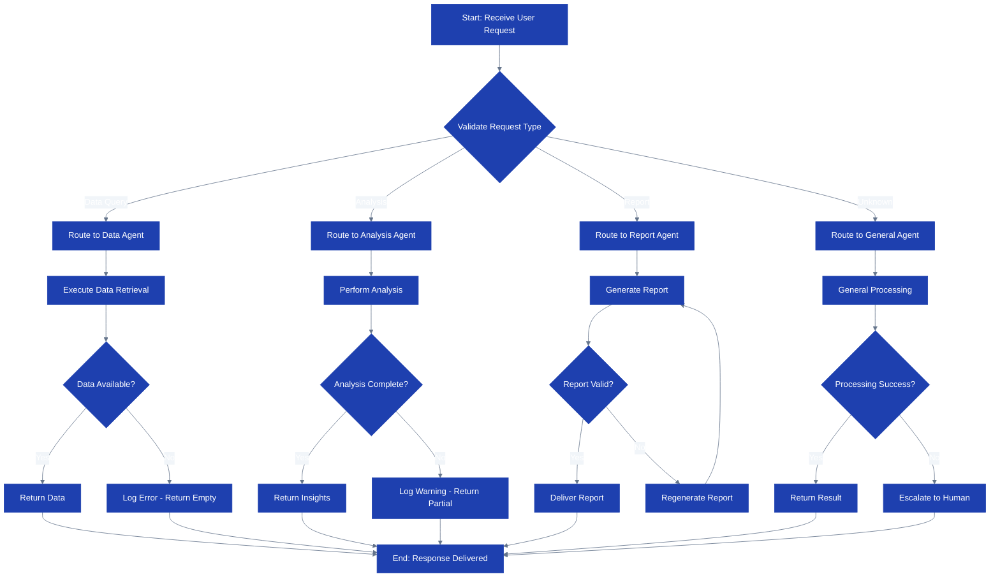
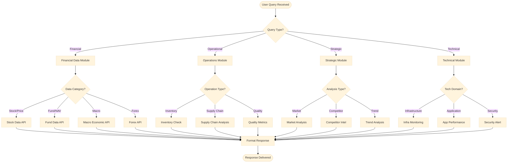
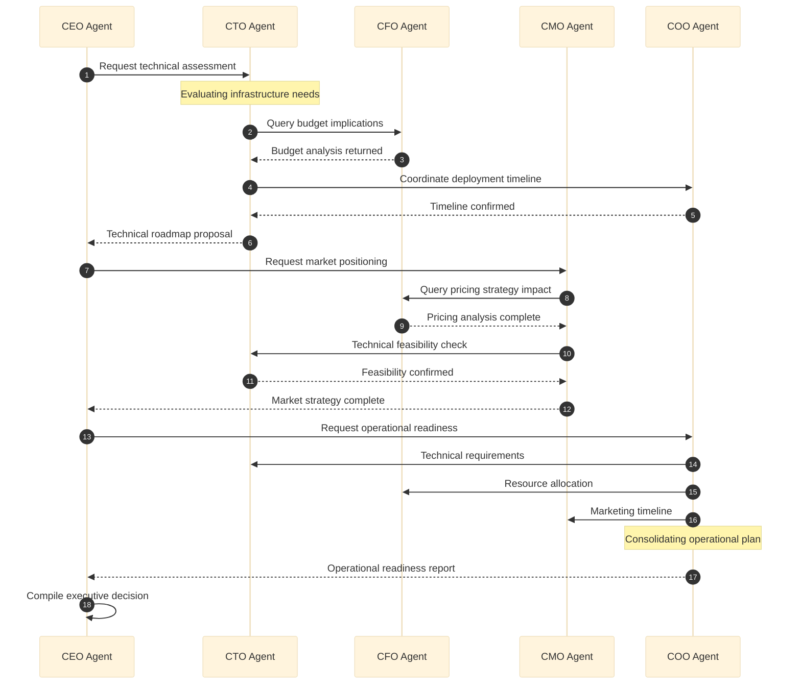
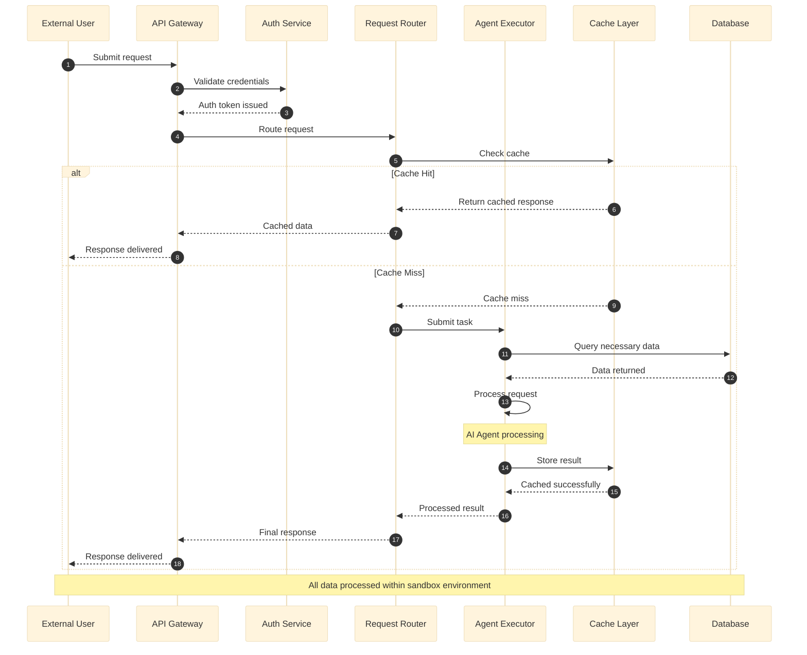
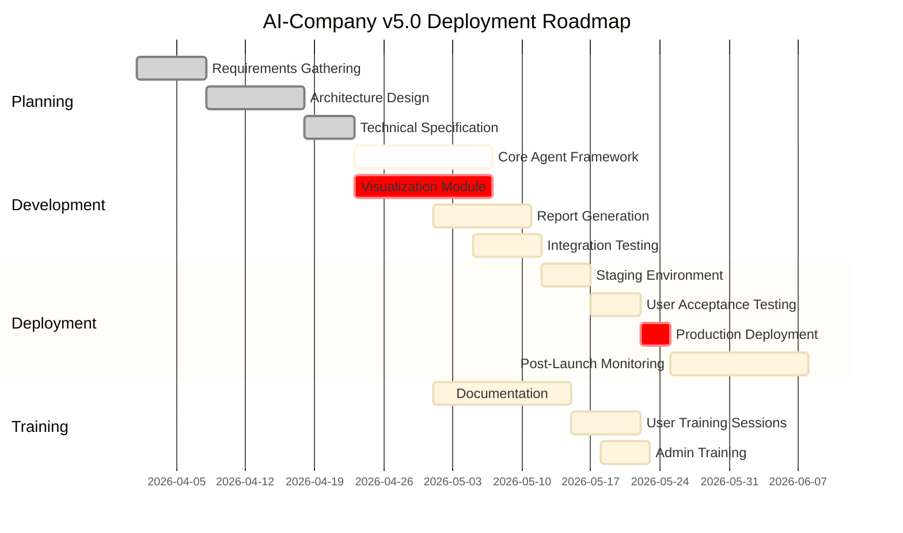
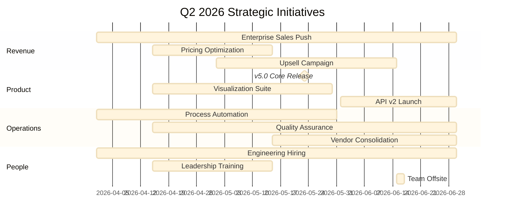
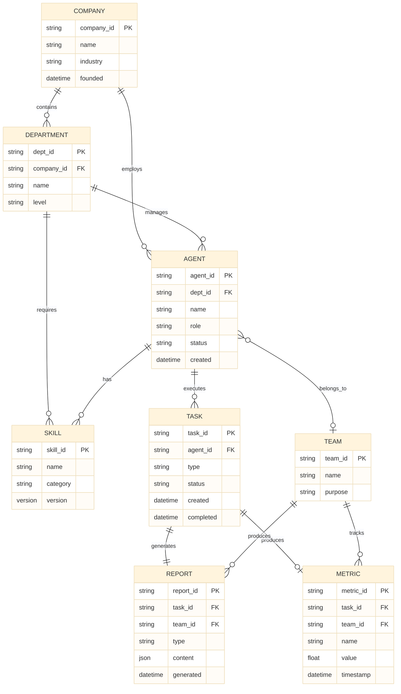
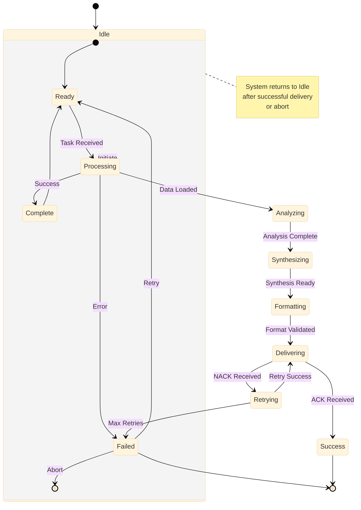

## 3. Mermaid Diagrams

Mermaid provides a text-based approach to creating diagrams that integrates seamlessly with Markdown documentation. The following templates cover the most common enterprise use cases.

### 3.1 Flowchart Templates

#### Basic Flowchart



#### Decision Tree Flowchart



### 3.2 Sequence Diagram Templates

#### Multi-Agent Communication Sequence



#### Request Processing Sequence



### 3.3 Gantt Chart Templates

#### Project Timeline Gantt



#### Quarterly Roadmap Gantt



### 3.4 Entity Relationship Diagram



### 3.5 State Diagram



#### Compliance Notes for Mermaid Diagrams

- All diagrams must include AIGC labeling in the comment block header
- Sequence diagrams should not exceed 15 participants for readability
- Gantt charts are limited to 20 tasks per chart
- ER diagrams must include primary keys (PK) and foreign keys (FK) notation
- State diagrams must have clear terminal states ([*])

---

## 4. Integration with CEO Command Center

This section describes how the visualization module integrates with the CEO command center to provide unified executive intelligence.

### 4.1 Architecture Overview

The visualization module operates as a plug-in component within the AI-Company unified skill architecture. The integration follows a layered approach:

```
┌─────────────────────────────────────────────────────────────┐
│                    CEO Command Center                       │
├─────────────────────────────────────────────────────────────┤
│  ┌─────────────────────────────────────────────────────┐   │
│  │           Visualization Module (This Guide)        │   │
│  │  ┌─────────┐ ┌─────────┐ ┌─────────┐ ┌────────┐ │   │
│  │  │ Charts  │ │Reports  │ │Diagrams │ │Integration│ │   │
│  │  │ (Chart.js│ │ Templates│ │(Mermaid)│ │   APIs    │ │   │
│  │  └─────────┘ └─────────┘ └─────────┘ └────────┘ │   │
│  └─────────────────────────────────────────────────────┘   │
├─────────────────────────────────────────────────────────────┤
│  ┌─────────────────────────────────────────────────────┐   │
│  │              Core AI-Company Framework              │   │
│  │  ┌─────────┐ ┌─────────┐ ┌─────────┐ ┌────────┐ │   │
│  │  │ HQ Core │ │ Audit   │ │Command  │ │ Response│ │   │
│  │  │ Module  │ │ Module  │ │ Parser  │ │  Formatter│ │   │
│  │  └─────────┘ └─────────┘ └─────────┘ └────────┘ │   │
│  └─────────────────────────────────────────────────────┘   │
└─────────────────────────────────────────────────────────────┘
```

### 4.2 Data Flow Integration

The visualization module receives structured data from the CEO command center through the following flow:

1. **Request Reception**: The CEO agent receives a natural language query
2. **Intent Classification**: Determines if visualization is needed
3. **Data Aggregation**: HQ core module gathers required data
4. **Template Selection**: Choose appropriate visualization template
5. **Rendering**: Generate HTML with embedded Chart.js or Mermaid
6. **Compliance Check**: Verify AIGC labeling and data safety
7. **Delivery**: Present visualization to user

### 4.3 Command Center API Reference

#### Available Visualization Commands

| Command | Description | Output |
|---------|-------------|--------|
| `show chart [type]` | Generate specific chart type | HTML with Chart.js |
| `generate report [template]` | Create report from template | Formatted HTML report |
| `render diagram [type]` | Create Mermaid diagram | SVG/PNG diagram |
| `export dashboard` | Export current view | Standalone HTML |

#### Integration Code Example

```javascript
// Integration example for CEO Command Center
// AIGC Generated Content - Internal Use Only

const VisualizationModule = {
  // Chart configuration presets
  chartPresets: {
    line: { tension: 0.4, fill: true, borderWidth: 2 },
    bar: { borderRadius: 6, barPercentage: 0.8 },
    pie: { cutout: 0, hoverOffset: 10 },
    doughnut: { cutout: '60%', hoverOffset: 12 }
  },

  // Color palettes for enterprise dashboards
  colorPalettes: {
    primary: ['#1e40af', '#3b82f6', '#60a5fa', '#93c5fd', '#dbeafe'],
    success: ['#059669', '#10b981', '#34d399', '#6ee7b7'],
    warning: ['#d97706', '#f59e0b', '#fbbf24'],
    danger: ['#dc2626', '#ef4444', '#f87171'],
    neutral: ['#64748b', '#94a3b8', '#cbd5e1', '#e2e8f0']
  },

  // Default configuration
  defaults: {
    responsive: true,
    maintainAspectRatio: false,
    animation: { duration: 750, easing: 'easeInOutQuart' },
    plugins: {
      legend: { position: 'bottom', labels: { padding: 16 } },
      tooltip: { enabled: true, callbacks: {} },
      datalabels: { display: false }
    }
  },

  // Create chart with presets
  createChart: function(type, data, options = {}) {
    const config = {
      type: type,
      data: data,
      options: {
        ...this.defaults,
        ...options,
        plugins: {
          ...this.defaults.plugins,
          ...(options.plugins || {})
        }
      }
    };
    
    // Inject AIGC compliance callback
    if (config.options.plugins.tooltip) {
      const originalFooter = config.options.plugins.tooltip.callbacks.footer;
      config.options.plugins.tooltip.callbacks.footer = function() {
        const defaultFooter = '\nAIGC Generated - Verify Data Accuracy';
        return originalFooter ? originalFooter() + defaultFooter : defaultFooter;
      };
    }
    
    return new Chart(config);
  },

  // Generate report from template
  generateReport: function(templateName, data) {
    const templates = this.reportTemplates;
    if (!templates[templateName]) {
      throw new Error(`Template '${templateName}' not found`);
    }
    
    const template = templates[templateName];
    return this.renderTemplate(template, data);
  },

  // Render Mermaid diagram
  renderMermaid: function(definition, container) {
    // Sanitize input to prevent injection
    const sanitized = this.sanitizeMermaid(definition);
    
    mermaid.init({
      theme: 'base',
      securityLevel: 'loose',
      fontFamily: 'system-ui, sans-serif'
    }, sanitized);
  },

  // Security: Prevent injection in Mermaid
  sanitizeMermaid: function(input) {
    // Remove any potentially dangerous patterns
    return input
      .replace(/javascript:/gi, '')
      .replace(/on\w+=/gi, '')
      .replace(/<script/gi, '')
      .replace(/<\/script>/gi, '');
  },

  // Export dashboard as standalone HTML
  exportDashboard: function(chartInstances) {
    const html = this.generateStandaloneHTML(chartInstances);
    return this.createBlob(html, 'text/html');
  }
};
```

### 4.4 Dashboard Configuration

The visualization module supports configurable dashboard layouts:

```javascript
// Dashboard layout configurations
const dashboardLayouts = {
  executive: {
    name: 'Executive Overview',
    widgets: [
      { type: 'stat', position: 'top', metrics: ['revenue', 'users', 'growth'] },
      { type: 'line', position: 'main', chart: 'trend' },
      { type: 'table', position: 'side', data: 'topAccounts' }
    ]
  },
  
  financial: {
    name: 'Financial Dashboard',
    widgets: [
      { type: 'gauge', position: 'top', metrics: ['target', 'achieved', 'forecast'] },
      { type: 'bar', position: 'main', chart: 'revenueByRegion' },
      { type: 'pie', position: 'side', chart: 'expenseBreakdown' }
    ]
  },
  
  operational: {
    name: 'Operations Center',
    widgets: [
      { type: 'heatmap', position: 'main', data: 'activityMap' },
      { type: 'gantt', position: 'below', data: 'projectTimeline' },
      { type: 'table', position: 'side', data: 'incidents' }
    ]
  }
};
```

### 4.5 Performance Optimization

To ensure optimal performance in the CEO command center:

1. **Lazy Loading**: Charts are rendered only when visible in viewport
2. **Debounced Updates**: Data refreshes are debounced to prevent excessive re-renders
3. **Web Workers**: Heavy data processing occurs off the main thread
4. **Canvas Caching**: Rendered charts are cached as images during scroll
5. **Progressive Enhancement**: Basic HTML tables are shown while charts load

---

